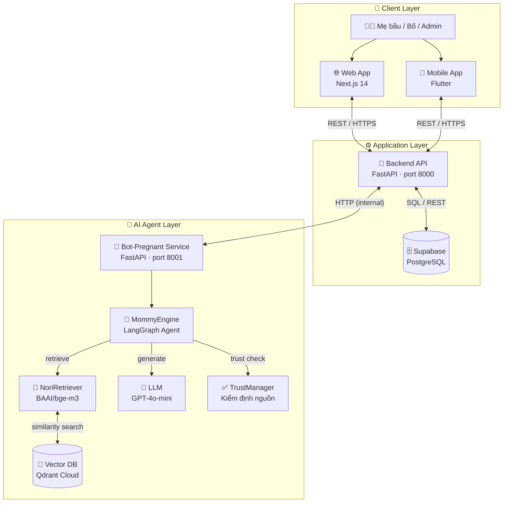
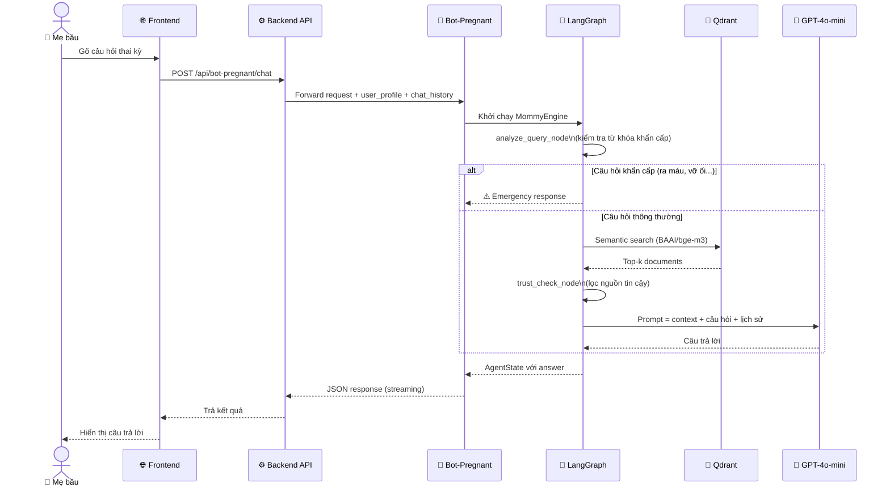
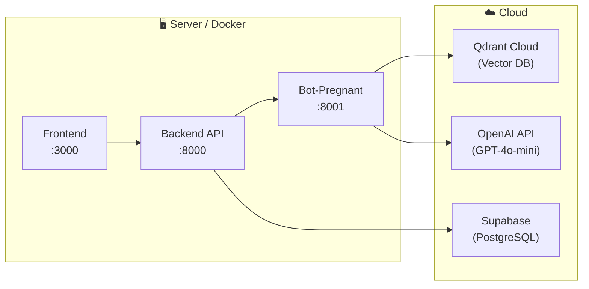
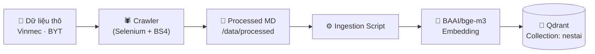

# 🏛️ NestAI — Kiến trúc hệ thống

Tài liệu này mô tả kiến trúc tổng thể của NestAI, bao gồm các thành phần, luồng dữ liệu, và cách User tương tác với App và AI Agent.

---

## Tổng quan

NestAI được xây dựng theo kiến trúc **microservice** gồm 3 lớp chính:

1. **Client Layer** — Giao diện người dùng (Web + Mobile)
2. **Application Layer** — Backend API xử lý nghiệp vụ
3. **AI Agent Layer** — RAG engine chuyên biệt cho thai kỳ

---

## Sơ đồ kiến trúc tổng thể



---

## Luồng hội thoại AI (User → App → AI Agent)



---

## Chi tiết các thành phần

### 1. Client Layer

| Thành phần | Công nghệ | Vai trò |
|------------|-----------|---------|
| Web App | Next.js 14, TypeScript, Tailwind CSS | Dashboard mẹ/bố/admin, chatbot, blog |
| Mobile App | Flutter | Ứng dụng di động đa nền tảng |

**Các màn hình chính:**
- `LandingPage` — Trang giới thiệu (chưa đăng nhập)
- `MomDashboard` — Bảng điều khiển cho mẹ bầu
- `DadDashboard` — Theo dõi cùng gia đình
- `AdminDashboard` — Quản trị hệ thống

---

### 2. Application Layer (Backend API)

**FastAPI** chạy tại `port 8000`, đóng vai trò API Gateway và xử lý toàn bộ nghiệp vụ.

| Route prefix | Chức năng |
|---|---|
| `/api/auth` | Đăng ký, đăng nhập, JWT |
| `/api/users` | Hồ sơ người dùng |
| `/api/nutrition` | Dinh dưỡng, thực đơn |
| `/api/health` | Sức khỏe, chỉ số thai kỳ |
| `/api/babies` | Theo dõi bé |
| `/api/missions` | Nhiệm vụ sức khỏe |
| `/api/recommendations` | Gợi ý thực phẩm |
| `/api/chat-history` | Lịch sử hội thoại AI |
| `/api/wellness` | Sức khỏe tinh thần |
| `/api/blog` | Bài viết kiến thức |
| `/api/medical-profile` | Hồ sơ y tế |
| `/api/stores` | Đối tác / cửa hàng |
| `/bot-pregnant/*` | Proxy đến AI Agent |

**Database:** Supabase (PostgreSQL) — lưu trữ dữ liệu người dùng, lịch sử, hồ sơ y tế.

---

### 3. AI Agent Layer (Bot-Pregnant)

**FastAPI** chạy tại `port 8001`, độc lập với backend chính để dễ scale.

```
Request
  └─► MommyEngine (LangGraph)
        ├─► analyze_query_node  — Phát hiện tình huống khẩn cấp
        ├─► retrieve_node       — Tìm kiếm ngữ nghĩa (Qdrant)
        ├─► trust_check_node    — Lọc & kiểm định nguồn tin
        └─► generate_node       — Sinh câu trả lời (GPT-4o-mini)
```

**Nguồn dữ liệu RAG:**
- Vinmec — hàng trăm bài viết sức khỏe thai kỳ tiếng Việt
- Quyết định Bộ Y tế — 776/QĐ-BYT, 1470/QĐ-BYT, 4128/QĐ-BYT
- Hướng dẫn chăm sóc sức khỏe sinh sản

**Embedding model:** `BAAI/bge-m3` (đa ngôn ngữ, 1024 chiều)

**Vector DB:**
- Production: Qdrant Cloud (`nestai` collection)
- Local/dev: Chroma (không cần cấu hình thêm)

**Safety layer:** Các từ khóa khẩn cấp (ra máu, vỡ ối, co giật...) kích hoạt immediate emergency response — không qua retrieval.

---

## Sơ đồ triển khai (Deployment)



---

## Luồng dữ liệu RAG (ingestion)



---

## Công nghệ & phụ thuộc chính

```
LangGraph ──────► StateGraph với conditional routing
LangChain ──────► Chains, document loaders, vector stores
LiteLLM ────────► Abstraction layer đa LLM provider
BAAI/bge-m3 ────► Embedding đa ngôn ngữ (HuggingFace)
Qdrant ─────────► Vector database (cloud-native)
FastAPI ────────► Backend API + Bot service
Next.js ────────► Frontend (SSR + App Router)
Flutter ────────► Cross-platform mobile
Supabase ───────► PostgreSQL + Auth + Storage
Docker ─────────► Containerization
```
