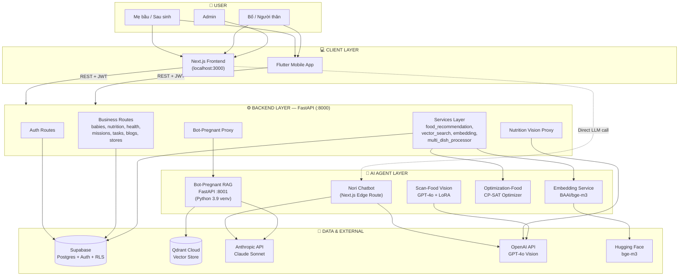
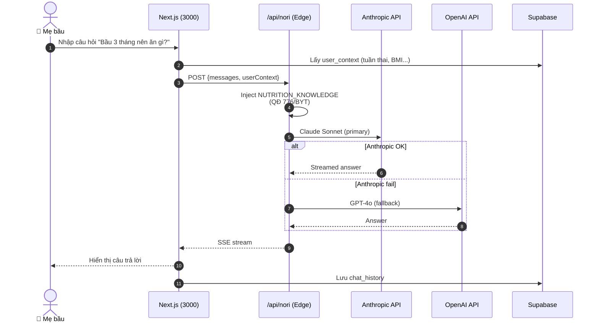
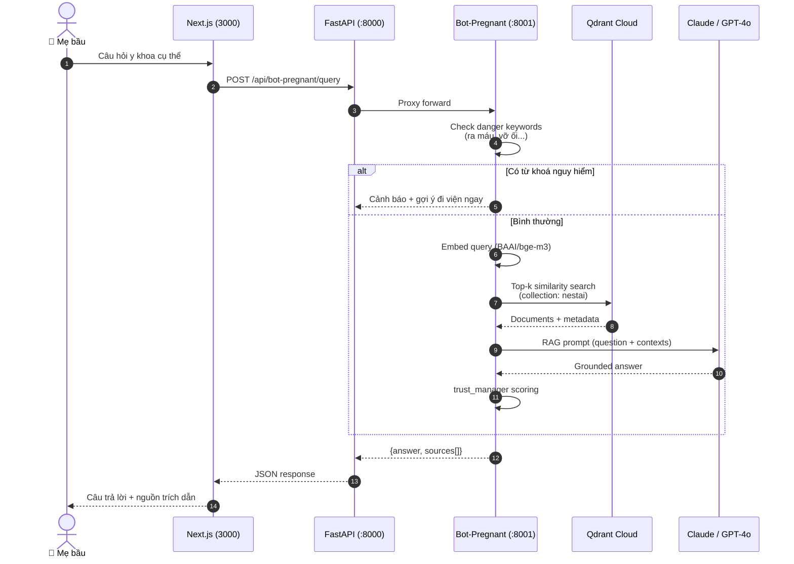

# NestAI — Architecture Document

> Sơ đồ kiến trúc tổng thể, thể hiện luồng tương tác **User ↔ App ↔ AI Agent** của hệ thống NestAI (ứng dụng dinh dưỡng & sức khỏe thai kỳ / sau sinh).

---

## 1. Tổng quan hệ thống

NestAI gồm **4 lớp** chính:

| Lớp | Vai trò | Công nghệ |
|---|---|---|
| **Client** | Giao diện người dùng (web + mobile) | Next.js 14 (App Router), React, Tailwind, Flutter (mobile) |
| **Backend API** | Business logic, auth, dữ liệu nghiệp vụ | FastAPI (Python 3.12), Pydantic |
| **AI Agents** | Suy luận, RAG, tối ưu, nhận diện ảnh | LiteLLM, Qdrant, CP-SAT, GPT-4o Vision, Claude Sonnet |
| **Data & Infra** | Lưu trữ, vector store, auth | Supabase (Postgres + RLS + Auth), Qdrant Cloud, Hugging Face |

---

## 2. Sơ đồ kiến trúc tổng thể



---

## 3. Luồng User – App – AI Agent (3 ví dụ điển hình)

### 3.1 Flow A — Hỏi Nori chatbot (Conversational AI)



**Đặc điểm**:
- Edge route, gọi LLM trực tiếp từ Next.js (không qua FastAPI) → low-latency.
- Knowledge base nội suy theo QĐ 776/QĐ-BYT (2017) chèn vào system prompt.
- Fallback Anthropic → OpenAI để đảm bảo availability.

---

### 3.2 Flow B — Hỏi RAG (Bot-Pregnant với kho tri thức Vinmec)



**Đặc điểm**:
- Bot-Pregnant chạy **process riêng (port 8001)** trên Python 3.9 venv vì PyTorch 2.2.2 ceiling trên Intel Mac.
- FastAPI backend làm **proxy** (`bot_pregnant.py`) để client không cần biết port nội bộ.
- **trust_manager** đánh giá độ tin cậy từng nguồn trước khi trả lời.

---

### 3.3 Flow C — Scan ảnh món ăn + Gợi ý thực đơn tối ưu

```mermaid
sequenceDiagram
    autonumber
    actor User as 👤 User
    participant FE as Next.js
    participant BE as FastAPI (:8000)
    participant Vision as OpenAI GPT-4o Vision
    participant Vec as Vector Search Service
    participant Opt as CP-SAT Optimizer
    participant Supa as Supabase (nutrition_database)

    User->>FE: Upload ảnh món ăn
    FE->>BE: POST /api/nutrition/scan (base64 image)
    BE->>Vision: Detect dishes & nutrients
    Vision-->>BE: {dishes:[{name, calo, protein...}]}
    BE->>Vec: Semantic similarity (pgvector)
    Vec->>Supa: Match dish với nutrition_database
    Supa-->>Vec: Enriched dish records
    Vec-->>BE: Normalized dishes
    BE->>Supa: Insert nutrition_logs
    BE-->>FE: Scan result

    Note over User,Supa: Sau khi user yêu cầu gợi ý thực đơn

    User->>FE: Click "Gợi ý bữa hôm nay"
    FE->>BE: GET /api/recommendations/full-day
    BE->>Supa: Fetch user profile + dishes pool
    BE->>Opt: recommend_full_day_meals()
    Note over Opt: CP-SAT solve constraints:<br/>kcal, protein, fat,<br/>vi chất theo QĐ 776
    Opt-->>BE: Optimal meal plan
    BE-->>FE: 3 bữa + snack
    FE-->>User: Hiển thị thực đơn
```

**Đặc điểm**:
- **Scan-Food**: GPT-4o Vision (`OPENAI_MODEL_SCAN_FOOD=gpt-4o`) + LoRA fine-tune local (đã train trong `agents/scan-food/`).
- **Vector search**: dùng pgvector embedding bge-m3 để match dish nhận diện với DB chuẩn.
- **Optimizer**: Google OR-Tools CP-SAT với ràng buộc dinh dưỡng QĐ 776/BYT.

---

## 4. Chi tiết từng lớp

### 4.1 Client Layer

| Module | Đường dẫn | Vai trò |
|---|---|---|
| Web App | `src/frontend/app/` | Trang chính, profile, baby-journey, nutrition, planner, nori, wellness, admin |
| API Routes (Edge) | `src/frontend/app/api/nori/` | Edge route cho chatbot Nori |
| Mobile | `src/mobile/` | Flutter app — gọi cùng FastAPI backend |
| Auth | Supabase Auth qua `@supabase/supabase-js` | JWT lưu cookie/localStorage |

### 4.2 Backend Layer (FastAPI, port 8000)

**Cấu trúc**:
```
src/backend/app/
├── api/routes/        # 17 route modules (auth, users, babies, nutrition, ...)
├── core/              # config, supabase_client
├── services/          # business logic (recommendation, vector, embedding)
├── models/            # Pydantic models
└── schemas/           # Request/response schemas
```

**Routes nổi bật**:
- `/api/auth` — đăng ký, đăng nhập, refresh
- `/api/babies` — CRUD baby + medical_profile
- `/api/nutrition` — scan ảnh, log bữa ăn, vision proxy
- `/api/recommendations` — gợi ý thực đơn (CP-SAT)
- `/api/bot-pregnant` — proxy tới RAG service :8001
- `/api/chat-history` — lưu/đọc lịch sử chat Nori
- `/api/wellness`, `/api/missions`, `/api/tasks`, `/api/blog`, `/api/stores`, `/api/admin`

**Middleware**: CORS (whitelist `localhost:3000` + `nestai.vercel.app`), JWT auth qua Supabase.

### 4.3 AI Agent Layer

| Agent | Process | Stack | Mục đích |
|---|---|---|---|
| **Nori Chatbot** | Next.js Edge Route | Anthropic Claude Sonnet (primary), GPT-4o (fallback) | Tư vấn dinh dưỡng theo QĐ 776/BYT |
| **Bot-Pregnant RAG** | FastAPI :8001 (Python 3.9) | bge-m3 embedding → Qdrant → Claude/GPT-4o | Q&A y khoa từ kho Vinmec |
| **Scan-Food** | Sync trong FastAPI | GPT-4o Vision + LoRA fine-tune | Nhận diện món ăn từ ảnh |
| **Optimization-Food** | Library import | OR-Tools CP-SAT | Gợi ý thực đơn tối ưu |
| **Embedding Service** | Library trong backend | Hugging Face `BAAI/bge-m3` | Tạo embedding 1024-d |
| **Generic Agent Loop** | `agents/agent.py` | LiteLLM (model-agnostic: Anthropic/OpenAI/Google/Mistral) | Tool-calling agent skeleton |

### 4.4 Data Layer

| Store | Mục đích | Tables / Collections nổi bật |
|---|---|---|
| **Supabase Postgres** | OLTP + Auth + RLS | `users`, `babies`, `partnerships`, `medical_profiles`, `daily_entries`, `nutrition_logs`, `nutrition_database`, `chat_history`, `notifications`, `missions`, `tasks`, `blogs`, `stores` |
| **Qdrant Cloud** | Vector store cho RAG | `nestai` (1024-d, bge-m3) |
| **Hugging Face** | Model hosting | `BAAI/bge-m3` |

---

## 5. Stack & cấu hình runtime

```
┌─────────────────────────────────────────────────────────────────┐
│                    LOCAL DEV TOPOLOGY                           │
├─────────────────────────────────────────────────────────────────┤
│  Port 3000   →  Next.js (frontend + Nori edge route)            │
│  Port 8000   →  FastAPI (backend chính)                         │
│  Port 8001   →  Bot-Pregnant RAG service (Python 3.9 venv)      │
│                                                                 │
│  Env files:                                                     │
│    • src/backend/.env       — API keys, Supabase, Qdrant        │
│    • src/frontend/.env.local — Supabase URL, NORI keys          │
│                                                                 │
│  Khởi động: ./run.sh        (chạy đồng thời FE + BE)            │
└─────────────────────────────────────────────────────────────────┘
```

**API keys cần có**:
- `ANTHROPIC_API_KEY` — Claude Sonnet (chatbot + RAG)
- `OPENAI_API_KEY` — GPT-4o Vision + fallback chat
- `HF_TOKEN` — load bge-m3
- `QDRANT_URL` + `QDRANT_API_KEY` — vector store
- `SUPABASE_URL` + `SUPABASE_ANON_KEY` + `SUPABASE_SERVICE_KEY`

---

## 6. Non-functional concerns

| Mối quan tâm | Giải pháp |
|---|---|
| **Bảo mật API key** | Tất cả LLM calls đều server-side (Next.js API routes hoặc FastAPI); FE không thấy key. |
| **RLS bảo vệ dữ liệu** | Supabase Row-Level Security bật trên `babies`, `medical_profiles`, `chat_history`; backend dùng service key để bypass khi cần. |
| **Latency RAG** | Pre-warm embedding + retriever ở `lifespan` startup; cache 5 phút theo (question, stage). |
| **Resilience LLM** | Nori dùng provider fallback Anthropic → OpenAI; scan-food retry với backoff. |
| **Tách process AI nặng** | RAG service tách ra port 8001 để cô lập dependency (PyTorch ceiling). |
| **An toàn y khoa** | Bot-Pregnant chặn câu hỏi nguy hiểm bằng `DANGER_KEYWORDS` → khuyến cáo đi viện thay vì trả lời AI. |
| **Chi phí** | Cache trả lời RAG; CP-SAT thay LLM cho bài toán tối ưu thực đơn (rẻ + deterministic). |

---

## 7. Roadmap mở rộng (gợi ý)

1. **Agent orchestration**: dùng `agents/agent.py` (LiteLLM) làm planner gọi các agent con (RAG, Vision, Optimizer) qua tool-calling.
2. **Vercel AI Gateway**: thay thế hard-coded fetch tới Anthropic/OpenAI để có observability + failover tập trung.
3. **Streaming everywhere**: chuyển Bot-Pregnant sang SSE streaming (hiện đã có `/stream` endpoint).
4. **Mobile parity**: Flutter mobile gọi cùng `/api/*`, dùng chung JWT.
5. **Vector DB consolidation**: cân nhắc đưa hết embeddings về pgvector (Supabase) để giảm phụ thuộc Qdrant.

---

*Cập nhật: 2026-05 — phản ánh codebase hiện tại tại `src/frontend`, `src/backend`, `src/agents`.*
