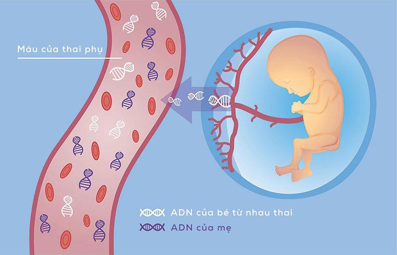

# Tuần 10

## **1\. Giải pháp nhanh chóng khi mẹ bầu bị đầy bụng trong 3 tháng đầu**

* 03:52:08 19-08-2025
* 2 phút đọc  
* 2k

Khi mang thai, đặc biệt là trong 3 tháng đầu, nhiều mẹ bầu thường cảm thấy khó chịu do tình trạng đầy bụng. Đây là một hiện tượng phổ biến, nhưng lại có thể khiến bạn lo lắng và không thoải mái. Nếu bạn đang tìm kiếm giải pháp nhanh chóng để cải thiện tình trạng này, hãy cùng 9thang10ngay khám phá những cách đơn giản và hiệu quả nhé\!

### **1\. Biểu hiện của đầy bụng khi mang thai**

Khi bị đầy bụng, mẹ bầu sẽ cảm thấy bụng nặng nề, ậm ạch kèm theo cảm giác ợ hơi, buồn nôn, chán ăn hoặc ăn nhanh no. Những triệu chứng này không chỉ gây khó chịu mà còn có thể ảnh hưởng đến tinh thần, khiến mẹ bầu cảm thấy lo lắng về sức khỏe. Dù đây là tình trạng phổ biến và thường không gây nguy hiểm nhưng nếu để kéo dài, nó có thể làm giảm khẩu vị, khiến mẹ bầu không muốn ăn và dẫn đến thiếu hụt dinh dưỡng.

### **2\. Tại sao mẹ bầu lại bị đầy bụng trong 3 tháng đầu?**

Trong giai đoạn đầu của thai kỳ, cơ thể mẹ bầu phải thích nghi với những thay đổi lớn. Lượng hormone progesterone tăng cao để giữ thai an toàn cũng đồng thời làm giãn cơ ruột, dẫn đến việc tiêu hóa chậm lại. Điều này khiến cho thức ăn bị tích tụ lâu hơn trong dạ dày và ruột, gây ra hiện tượng đầy bụng, chướng hơi. Thêm vào đó, việc ăn những thực phẩm khó tiêu, không phù hợp hoặc tăng lượng thức ăn cũng có thể là nguyên nhân khiến dạ dày làm việc quá tải, khiến tình trạng đầy bụng trở nên nghiêm trọng hơn. 

*Có nhiều nguyên nhân dẫn đến tình trạng đầy bụng ở mẹ bầu.* 

### **3\. Giải pháp giúp bầu giảm đầy bụng khi mang thai** 

Đầy bụng trong 3 tháng đầu thai kỳ là triệu chứng phổ biến gây khó chịu cho mẹ bầu. Dưới đây là một số biện pháp giúp mẹ cải thiện tình trạng này:

#### **3.1. Chế độ ăn uống khi bị đầy bụng** 

\- **Chọn thực phẩm mềm, dễ tiêu hóa:** Các loại thức ăn mềm, lỏng như rau xanh, khoai lang, và trái cây giàu chất xơ như đu đủ chín, táo, nho sẽ giúp hệ tiêu hóa hoạt động tốt hơn và nhuận tràng. Mẹ cũng lưu ý nên tăng lượng chất xơ dần dần để tránh bị táo bón do tiêu thụ quá nhiều chất xơ cùng lúc.

\- **Bổ sung lợi khuẩn:** Sữa chua và sữa chua uống lên men chứa nhiều lợi khuẩn, giúp hệ tiêu hóa hoạt động hiệu quả hơn và giảm tình trạng đầy hơi, chướng bụng.

\- **Uống đủ nước:** Mẹ bầu nên uống ít nhất 8 – 10 ly nước mỗi ngày. Nước sẽ giúp đẩy thức ăn xuống ruột và làm mềm phân, dễ dàng hơn khi đào thải. Nếu mẹ bầu bị đầy bụng do hội chứng ruột kích thích thì nên tránh uống nước trái cây có nhiều đường vì có thể làm tình trạng đầy bụng tồi tệ hơn. 

*Uống đủ nước mỗi ngày giúp làm mềm phân và hỗ trợ tiêu hóa của mẹ bầu khi bị đầy bụng.*

#### **3.2. Nguyên tắc ăn uống và sinh hoạt để mẹ bầu tránh bị đầy bụng** 

Để hạn chế tình trạng đầy bụng, mẹ bầu cần áp dụng một số nguyên tắc ăn uống và lối sống sau:

\- **Chia nhỏ bữa ăn**: Thay vì ăn 3 bữa chính, mẹ nên chia thành 5-6 bữa nhỏ trong ngày để giảm áp lực cho dạ dày. Điều này giúp mẹ ăn vừa đủ mỗi bữa, dễ tiêu hóa hơn và ngăn ngừa cảm giác đầy hơi.

\- **Ưu tiên đồ ăn mềm**: Khi bị đầy bụng, mẹ nên ăn các món lỏng, mềm như cháo hoặc súp để dễ tiêu hóa và giảm cảm giác khó chịu.

\- **Ăn chậm và nhai kỹ**: Ăn nhanh có thể khiến không khí vào dạ dày gây đầy hơi. Mẹ nên ăn từ từ, nhai kỹ để hạn chế lượng khí và giúp thức ăn tiêu hóa tốt hơn. Trong bữa ăn, hãy giữ tinh thần thư giãn, tránh căng thẳng để hệ tiêu hóa hoạt động hiệu quả.

\- **Vận động nhẹ nhàng**: Sau khi ăn, mẹ có thể đi dạo nhẹ nhàng để kích thích tiêu hóa. Tránh nằm ngay sau khi ăn vì điều này có thể ảnh hưởng đến chức năng co bóp của dạ dày, khiến thức ăn không tiêu hóa tốt, gây đầy bụng hoặc trào ngược dạ dày. 

*Cháo, súp là những món ăn dễ tiêu hoá, giúp giảm đầy hơi khi mang thai.* 

**Những loại thức ăn nên tránh:**

\+ **Đồ ăn lên men:** Các món như dưa chua, cà muối, hành muối có thể làm tăng axit trong dạ dày, khiến tình trạng đầy bụng nặng hơn.

\+ **Thức ăn nhanh:** Như gà rán, hamburger chứa nhiều dầu mỡ sẽ làm việc tiêu hóa trở nên khó khăn hơn.

\+ **Thực phẩm dễ gây sinh khí:** Như bắp cải, hành, đậu, bông cải xanh.

\+ **Đường tinh luyện và đồ uống nhiều đường:** Như nước có ga, nước ngọt, nước tăng lực chứa fructose có thể làm trầm trọng thêm tình trạng đầy bụng, chướng hơi, và không tốt cho sức khỏe của mẹ và bé.

Hy vọng những thông tin trên sẽ giúp bạn giải quyết tình trạng đầy bụng khi mang thai. Mặc dù không nguy hiểm nhưng đầy bụng gây nhiều khó chịu. Với chế độ ăn uống và lối sống phù hợp, bạn sẽ cảm thấy thoải mái hơn trong suốt thai kỳ.

---

## **2\. Xét nghiệm sàng lọc trước sinh NIPT và ưu điểm vượt trội của NIPT**

* [Sức Khoẻ](https://9thang10ngay.net/post/archive-layout1.html)  
* [Xét Nghiệm](https://9thang10ngay.net/post/archive-layout1.html)

* 23:40:22 15-10-2021  
* 2 phút đọc  
* 2k

### **NIPT là gì?**

Xét nghiệm tiền sản NIPT (Non Invasive Prenatal genetic Tesing) là một xét nghiệm sàng lọc trước sinh không xâm lấn thông qua giải trình tự DNA (vật liệu di truyền) thai nhi từ máu thai phụ.

Trong quá trình mang thai, từ tuần thứ 5-6 của thai kỳ, một lượng DNA (vật chất di truyền) của thai được giải phóng và di chuyển tự do trong dòng máu mẹ. 

Do đó, các nhà khoa học dựa trên đặc điểm này, thông qua lấy máu ngoại vi của mẹ, tách các DNA tự do này và tiến hành phân tích di truyền để đánh giá nguy cơ dị tật của thai nhi với mục đích hạn chế các xét nghiệm xâm lấn gây hại cho mẹ và bé.

NIPT là xét nghiệm sàng lọc trước sinh đã và đang phổ biến trên toàn thế giới, cũng như được sử dụng rộng rãi ở Việt Nam trong những năm gần đây. Hiện nay có gần 90 nước trên thế giới sử dụng NIPT cho mục đích sàng lọc trước sinh. 

Đặc biệt, NIPT đã được áp dụng trong hệ thống y tế ở các nước châu Âu hay Mỹ như là một xét nghiệm sàng lọc đầu tay cho các mẹ bầu chưa từng làm qua xét nghiệm sàng lọc nào hoặc dành cho những thai phụ có kết quả sàng lọc truyền thống (double test, triple test) nguy cơ từ trung bình đến cao (1/1000-1/51). 

Xét nghiệm NIPT thể hiện rõ ưu điểm của mình thông qua khả năng phát hiện bất thường ở thai nhi với độ chính xác hơn hẳn so với các xét nghiệm truyền thống. 

Bên cạnh đó NIPT còn tăng độ an toàn cho thai phụ và em bé khi làm xét nghiệm vì chỉ cần lấy máu tĩnh mạch của mẹ là đã có thể thực hiện xét nghiệm, tránh được các thủ thuật xâm lấn gây nguy hiểm cho mẹ bầu và thai nhi.

### **Các bệnh có thể được sàng lọc và phát hiện dựa vào xét nghiệm NIPT**

Thông qua việc đánh giá và phân tích ADN tự do của thai nhi có trong mẫu máu mẹ, các bệnh về rối loạn nhiễm sắc thể có thể dễ dàng được phát hiện. Các bệnh phổ biến bao gồm:

\- Hội chứng Down (Trisomy 21\)

\- Hội chứng Edwards (Trisomy 18\)

\- Hội chứng Patau (Trisomy 13\)

\- Những bất thường ở NST giới tính: hội chứng Turner (monosomy X), hội chứng Klinefelter (XXY), hội chứng Triple X (XXX), hội chứng Jacobs (XYY)...

*Phân tích ADN tự do của thai nhi có thể phát hiện các bệnh về rối loạn nhiễm sắc thể.*

### **Xét nghiệm sàng lọc trước sinh NIPT phù hợp với đối tượng nào?**

Các xét nghiệm sàng lọc trước sinh được khuyến cáo nên thực hiện với những phụ nữ mang thai thuộc 1 trong các trường hợp sau đây:

\- Gia đình có tiền sử mắc dị tật bẩm sinh: bại não, Down, hở hàm ếch,...

\- Thai phụ từng bị thai chết lưu, sinh non hoặc sảy thai nhiều lần trước đó.

\- Sàng lọc trước khi sinh là cần thiết với những phụ nữ mang thai trên 35 tuổi.

\- Thai phụ trong thời gian thai nghén đã từng sử dụng các loại thuốc chống chỉ định cho bà bầu.

\- Người mắc các bệnh mãn tính như thận, tiểu đường hoặc bị biến chứng thai kỳ.

\- Trước hoặc trong thời gian mang thai phải tiếp xúc với chất hóa học, phóng xạ trong thời gian dài. 

### **Xét nghiệm NIPT hoạt động dựa trên nguyên tắc nào?**

Trong thời gian mang thai, các ADN tự do của thai nhi sẽ di chuyển một lượng nhỏ vào máu của mẹ. Cùng với sự phát triển của thai nhi, hàm lượng ADN này cũng sẽ tăng lên theo. Dựa trên nguyên lý này, mẫu máu trực tiếp lấy từ cơ thể mẹ sẽ được dùng như mẫu bệnh phẩm cho xét nghiệm NIPT. Thông qua việc áp dụng kỹ thuật giải trình tự gen thế hệ mới (Next Generation Sequencing \- NGS) cùng với việc phân tích tin sinh học, bác sĩ có thể sàng lọc, phân tích và xác định được những vấn đề bất thường liên quan đến số lượng NST. 

*Thu các ADN tự do của thai nhi để phân tích các bất thường nhiễm sắc thể.*

Xét nghiệm NIPT sẽ đưa ra kết quả và được nhận xét dựa trên các thang điểm khác nhau. Từ đó, bác sĩ sẽ có những chẩn đoán và đánh giá cụ thể về nguy cơ mắc phải các bệnh lý bất thường ở thai nhi. 

Với công nghệ tiên tiến hiện đại, dù hàm lượng ADN tự do có trong máu mẹ là rất thấp thì xét nghiệm NIPT vẫn có thể xác định được tất cả những bất thường trên NST như thừa, thiếu đoạn, mất đoạn hay chuyển đoạn. Chính vì vậy, nói về độ chính xác và tính tin cậy của phương pháp này thì các mẹ có thể hoàn toàn yên tâm. 

### **Xét nghiệm NIPT có những ưu điểm gì?**

Nhờ vào những ưu điểm vượt trội của mình, xét nghiệm NIPT ngày càng trở nên phổ biến và được nhiều người lựa chọn:

\- Dị tật thai nhi có thể được sàng lọc và xác định ngay từ sớm với xét nghiệm NIPT (từ tuần thai thứ 9 trở đi). Từ đó có kết quả sàng lọc sớm để đưa ra phương án can thiệp kịp thời. 

\- Xét nghiệm NIPT rất an toàn đối với cả mẹ và bé bởi là phương pháp xét nghiệm không xâm lấn, chỉ sử dụng mẫu máu của mẹ chứ không cần sinh thiết gai nhau, chọc ối hay chọc hút máu cuống rốn,... 

\- NIPT có độ chính xác cao (đến 99%) do là phương pháp thực hiện phân tích dựa trên vật liệu di truyền ADN. 

\- Khả năng tầm soát và phát hiện các bệnh do bất thường NST gây ra là rất tốt.

\- Nhanh nhận được kết quả xét nghiệm NIPT, trung bình chỉ sau 5 \- 7 ngày.

### **Ý nghĩa của sàng lọc trước sinh NIPT**

Lợi ích mà xét nghiệm sàng lọc trước sinh NIPT đem lại có thể kể đến như:

\- Giảm thiểu lo lắng của cha mẹ về nguy cơ sinh con bị dị tật bẩm sinh. 

\- Giúp gia tăng khả năng trẻ sinh ra khỏe mạnh và phát triển bình thường.

\- Nếu thai nhi có dấu hiệu bất thường khi xét nghiệm sàng lọc trước sinh thì sẽ kịp thời có những biện pháp can thiệp và xử lý.

\- Giúp mẹ bầu hiểu biết để có những phương pháp chăm sóc con trẻ trong suốt thai kỳ một cách tốt nhất. 

#### Tags:
xét nghiệm, NIPT, xét nghiệm sàng lọc, xét nghiệm sàng lọc trước sinh
