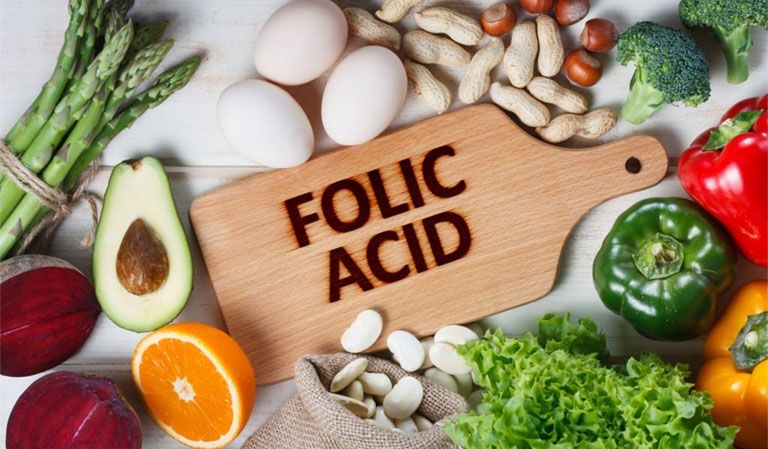

# Tuần 13

**Nám, sạm da khi mang thai: Mẹ bầu cần làm gì?**  
23:16:28 27-10-20212 phút đọc2k  
**1\. Tình trạng nám da khi mang thai**  
Nám da khi mang thai là hiện tượng bình thường và phổ biến ở các thai phụ. Nám da là tình trạng da tối màu kèm theo các mảng hay các đốm mờ và nó xuất hiện không đều theo thời gian.  
Nám da đôi khi còn được gọi là “mặt nạ thai kỳ” bởi các đốm mờ thường xuất hiện xung quanh môi, mũi, gò má, trán của thai phụ, trông nó giống với hình dạng của một chiếc mặt nạ.   
Tình trạng sạm da có thể xuất hiện dọc theo xương hàm hoặc cẳng tay và một số bộ phận khác trên cơ thể mà mẹ bầu tiếp xúc với ánh nắng mặt trời. Bên cạnh đó, một số bộ phận khác như núm vú, bộ phận sinh dục có thể trở nên tối màu hơn khi mang thai. Các bộ phận thường xảy ra ma sát như nách, đùi cũng sẽ trở nên tối màu hơn khi bạn mang thai.  
**2\. Nguyên nhân gây nám da khi mang thai**  
Trong thời gian mang thai, cơ thể phụ nữ có nhiều sự thay đổi hay thậm chí là rối loạn ở các cơ quan như: da, hệ tiêu hóa, tĩnh mạch,... Trong đó biến đổi về nội tiết thường gây nhiều rắc rối cho bà bầu, nám da là một trong những rắc rối đó.  
Phần lớn khi mang thai, da của phụ nữ sẽ trở nên xỉn màu hơn, lỗ chân lông to, vùng chữ T bóng nhờn và vùng da ở gò má bắt đầu xuất hiện các vết nám.  
  
*Nguyên nhân chính gây nám da khi mang thai là sự thay đổi nội tiết tố của mẹ bầu.*  
Nguyên nhân của hiện tượng trên là sự thay đổi nội tiết tố của phụ nữ trong giai đoạn mang thai kích thích quá trình sản sinh melanin \- sắc tố quyết định màu da, tóc và mắt của con người, gây nên tình trạng nám da.  
Phụ nữ có làn da sẫm màu thường dễ bị nám hơn phụ nữ có làn da sáng màu. Thai phụ cũng có khả năng bị nám da cao hơn nếu trong gia đình có người thân cũng gặp phải tình trạng này.  
Đây là nguyên nhân trực tiếp gây nên tình trạng nám da ở phụ nữ mang thai. Ngoài ra, thời gian trong thai kỳ, mẹ bầu thường mệt mỏi và dễ cảm thấy stress, nó cũng là tác nhân khiến cho các vết nám đậm màu hơn.   
Phần lớn các vết nám da sẽ biến mất sau khi sinh. Nám da khi mang thai chỉ là một hiện tượng sinh lý thông thường, mẹ bầu không nên quá lo lắng và có thể dùng một số cách để khắc phục tình trạng này  
**3\. Cách khắc phục nám khi mang thai**  
Mặc dù các triệu chứng da kể trên sẽ biến mất trong thai kỳ nhưng hầu như phụ nữ nào cũng không muốn nhìn thấy những vết nám ngày càng lan rộng và sậm màu trên làm da của mình. Mẹ bầu có thể áp dụng các biện pháp sau đây:  
**3.1. Bổ sung axit folic**  
Các nghiên cứu đã chỉ ra rằng sự thiếu hụt folate có thể liên quan đến sắc tố da. Vì vậy, mẹ bầu nên bổ sung đầy đủ axit folic cho cơ thể để có thể đảm bảo cho sức khỏe thai kỳ cũng như giảm tình trạng nám da. Các loại thực phẩm nhiều axit folic mà mẹ bầu nên thường xuyên bổ sung trong thực đơn ăn uống hàng ngày như: rau xanh thẫm, ngũ cốc, bánh mì, cam, bơ,…   
  
*Mẹ bầu nên bổ sung đầy đủ axit folic thông qua thực phẩm để bảo vệ làn da.*  
**3.2. Tránh ánh nắng mặt trời và dùng kem chống nắng**  
Tia UVA và UVB là những nguyên nhân chính kích thích sự hình thành các sắc tố melanin gây nám da. Do vậy, phụ nữ mang thai nên tránh ánh nắng mặt trời vào thời điểm gay gắt nhất của ngày là từ 10 giờ sáng đến 3 giờ chiều cũng như bảo vệ da bằng cách che chắn cho da và dùng kem chống nắng khi ra ngoài nắng.   
Mẹ bầu cũng có thể sử dụng kem chống nắng, tuy nhiên cần lựa chọn các sản phẩm phù hợp cho bà bầu, không chứa các chất gây hại cho thai kỳ. Khi ra ngoài lúc trời nắng, bên cạnh việc thoa kem chống nắng, mẹ bầu cũng cần che chắn cho làn da của mình bằng cách đeo kính râm, đeo khẩu trang, đội mũ rộng vành và áo chống nắng,..  
**3.3. Sử dụng kem trị nám**  
Có thể điều trị nám khi mang thai bằng một số loại kem theo toa (như hydroquinone) và một số sản phẩm chăm sóc da không kê đơn. Tuy nhiên, trước khi lựa chọn phương pháp điều trị, hãy chắc chắn tham khảo ý kiến bác sĩ da liễu để chẩn đoán chính xác tình trạng này. Tránh tự ý sử dụng thuốc bôi vì có những loại thuốc chứa tỷ lệ phần trăm hydroquinone cao có thể ảnh hưởng xấu đến em bé.  
**4\. Phương pháp trị nám KHÔNG nên dùng cho phụ nữ mang thai**  
\- **Mặt nạ hóa học:** đây là một loại chất lỏng đắp lên mặt, tạo ra một vết bỏng hóa học nhẹ, tương tự như cháy nắng. Qua thời gian, lớp da bỏng tróc ra và để lại làn da mới.  
Mặt nạ hóa học có nhiều loại mức độ khác nhau. Axit glycolic là một trong những loại nhẹ nhất, vì vậy mà nguy cơ để lại sẹo hay gây bạc màu da thường thấp hơn. Tuy nhiên, các loại mặt nạ này không an toàn để sử dụng trong thai kỳ vì axit alpha hydroxy (axit lactic và axit glycolic), axit salicylic hay retinol có trong mặt nạ này đều có khả năng ảnh hưởng ko tốt tới sức khỏe mẹ và bé.  
\- **Điều trị bằng laser:** phương pháp này cũng không tốt cho cả mẹ và bé, vì chúng có thể gây kích ứng da, đặc biệt là trong thời kỳ mang thai.  
  
*Phụ nữ mang thai không nên điều trị nám bằng laser.*  
**5\. Cách phòng ngừa tình trạng nám da khi mang thai**  
Tất cả các sự thay đổi về da do nám, sạm da thường tự biến mất sau khi sinh. Tuy nhiên, để phòng ngừa tình trạng sạm da khi mang thai, mẹ bầu có thể áp dụng một số cách mà vẫn đảm bảo an toàn cho thai nhi như sau:  
  
*Để giảm tình trạng sạm nám khi mang thai, mẹ bầu cần giữ cho tâm trạng thoải mái, vui vẻ.*  
\- Mẹ bầu cần giữ cho tâm trạng thoải mái, duy trì lối sống điều độ, vui tươi, hạn chế căng thẳng trong cuộc sống và công việc.  
\- Thường xuyên tập thể dục nhẹ nhàng để có sức khỏe tốt, đồng thời giúp điều tiết cho da thêm khỏe mạnh hồng hào.  
\- Mẹ bầu nên ăn nhiều rau xanh, hoa quả, uống nhiều nước cũng là biện pháp tốt để chống lại hiện tượng nám da và giúp da sẽ hạn chế được vết nhăn.  
\- Tăng cường các loại thực phẩm chứa nhiều canxi, vitamin A, C và E có nhiều trong sữa, cà rốt, cam, chanh, đu đủ, gấc, giá đỗ, đậu nành,...sẽ giúp làm đẹp da, trẻ hóa làn da, chống nám.  
\- Tránh dùng những loại thực phẩm có hại cho làn da cũng như thai kỳ như: rượu, bia, thuốc lá, các loại thực phẩm cay, nóng.  
\- Bà bầu nên hạn chế tiếp xúc với ánh nắng mặt trời, đặc biệt vào thời điểm từ 10h sáng tới 3h chiều vì đó là lúc cường độ cực tím rất cao dễ làm cho da bị “tổn thương”.
