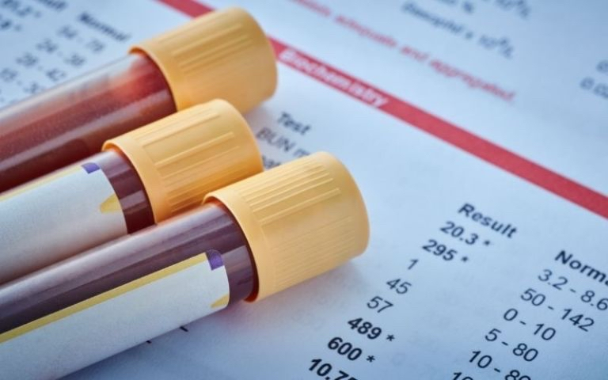

# Tuần 15

**So sánh 3 xét nghiệm sàng lọc dị tật thai nhi: Double test, Triple test và NIPT**  
09:47:04 11-04-20252 phút đọc2k  
Sàng lọc dị tật thai nhi là bước quan trọng giúp mẹ bầu theo dõi sự phát triển của bé. Ba xét nghiệm phổ biến là Double test, Triple test và NIPT đều có ưu điểm riêng, phù hợp với từng giai đoạn thai kỳ. Bài viết này sẽ giúp mẹ bầu hiểu rõ và lựa chọn phương pháp phù hợp nhất.  
**1\. Double test, Triple test và NIPT là gì?**  
Xét nghiệm Double test, Triple test và NIPT đều là các phương pháp sàng lọc dị tật thai nhi, giúp phát hiện các hội chứng như Down, Edwards, Patau và các bất thường nhiễm sắc thể khác.   
Các xét nghiệm này đo các chỉ số trong máu mẹ như sau:  
\- **Double test**: Đo nồng độ hai thành phần hCG và PAPP-A.  
\- **Triple test**: Đo nồng độ ba thành phần AFP, hCG và Estriol.  
\- **NIPT**: Là xét nghiệm không xâm lấn, phân tích DNA tự do của thai nhi trong máu mẹ.  
  
*Double test, Triple test và NIPT là ba sàng lọc trước sinh quan trọng với các mẹ bầu.*   
**2\. So sánh 3 xét nghiệm: Cái nào phù hợp với mẹ bầu?**   
**Tiêu chí**   
**Double test**   
**Triple test**   
**NIPT**  
**Thời điểm thực hiện**   
**Tuần 10 \- 14**của thai kỳ.  
**Tuần 15 \- 20**của thai kỳ.  
Từ **tuần 10 trở đi**.  
**Độ chính xác**   
Trung bình.  
Cao hơn Double test.  
Rất cao (trên 99% với hội chứng Down).  
**Dị tật sàng lọc**   
Hội chứng Down, Edwards.  
Hội chứng Down, Edwards, dị tật ống thần kinh.  
Hội chứng Down, Edwards, Patau và nhiều bất thường nhiễm sắc thể khác.  
**Ưu điểm**   
\- Chi phí thấp.  
\- Thực hiện sớm.  
\- Có kết quả nhanh.  
\- Sàng lọc được nhiều dị tật hơn.  
\- Độ chính xác cao hơn Double test.  
\- Độ chính xác cao nhất.  
\- Giảm nguy cơ kết quả sai.  
\- Không xâm lấn, an toàn tuyệt đối.  
**Nhược điểm**   
\- Độ chính xác không cao.  
\- Tỷ lệ sai dương khoảng **5%**.  
\- Cần xét nghiệm bổ sung nếu kết quả bất thường.  
\- Chi phí cao hơn Double test.  
\- Thời gian có kết quả lâu hơn.  
\- Có thể cần xét nghiệm bổ sung nếu nguy cơ cao.  
\- Chi phí cao nhất.  
\- Thời gian chờ kết quả lâu hơn Double test, Triple test (1-2 tuần).  
*Xét nghiệm NIPT có khả năng sàng lọc nhiều dị tật thai nhi hơn hẳn so với Double test và Triple test.*  
**3\. Mẹ bầu nên chọn xét nghiệm nào?**  
\- **Nếu mẹ dưới 35 tuổi, không có nguy cơ cao**: Có thể làm Double test hoặc Triple test.  
\- **Nếu mẹ trên 35 tuổi, có tiền sử dị tật thai nhi hoặc thai IVF**: Nên làm NIPT.  
\- **Nếu kết quả Double test/Triple test nguy cơ cao**: Xem xét làm NIPT hoặc xét nghiệm chẩn đoán.  
*Việc lựa chọn xét nghiệm phù hợp tùy thuộc vào sức khỏe thai kỳ, mong muốn của gia đình và tư vấn từ bác sĩ. Mẹ bầu nên đến cơ sở y tế uy tín để được hướng dẫn cụ thể, giúp sàng lọc dị tật thai nhi an toàn và hiệu quả.*
