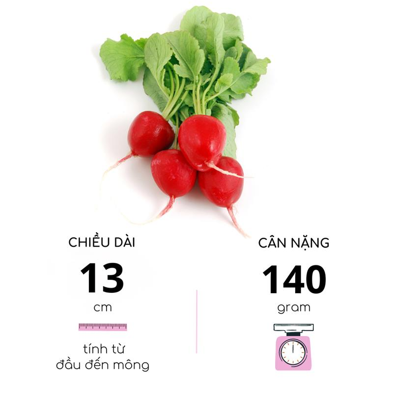
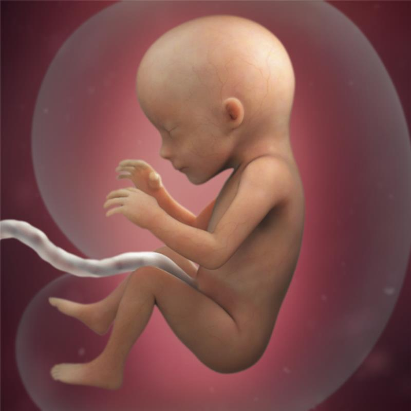
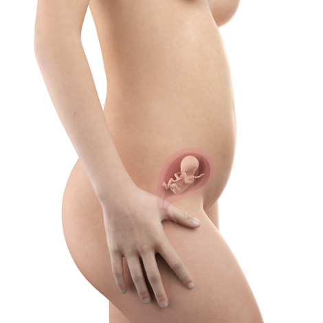
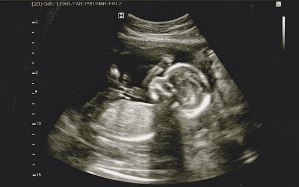

# Tuần 17

***Xu hướng thai giáo hiện nay – cho con trở thành đại thần từ trong bụng mẹ***  
*09:17:35 04-03-20222 phút đọc2k*  
***Xu hướng thai giáo hiện nay***  
*Thai giáo là mô hình giáo dục được áp dụng với quy mô rộng rãi trên toàn thế giới cho thai nhi. Đây hiện đang là xu hướng tích cực được các gia đình ưa chuộng bởi tính hiệu quả của nó mang lại nhiều lợi ích đáng mong đợi dành cho trẻ từ trong bụng mẹ.*  
*Ở Việt Nam, thai giáo đang dần trở nên được ưa chuộng trong đa số các gia đình. Tuy nhiên, phương pháp này vẫn còn khá mới mẻ đối với nhiều cặp vợ chồng, khiến cho phương thức áp dụng chưa thực sự đúng cách, nhiều thiếu sót dẫn đến việc mang lại hiệu quả tương đối thấp.*  
  
*Thai giáo tạo nên nền tảng phát triển cho bé từ trong bụng mẹ.*  
*Trong thực tế, thai giáo là quá trình giáo dục tổng hợp được áp dụng từ lúc đang mang thai. Quy trình thai giáo mang đến nhiều lợi ích tích cực cho thai nhi, giúp đẩy mạnh sự phát triển về thể chất và tinh thần. Từ đó xây dựng nền tảng vững chắc, trẻ khỏe mạnh, phát triển toàn diện từ trong bụng mẹ.*  
***Có hai cách chính để thai giáo được áp dụng: thai giáo gián tiếp và thai giáo trực tiếp.***  
*\- **Thai giáo gián tiếp** là phương pháp về bề mặt dinh dưỡng, giúp cho các cặp vợ chồng có thể chủ động điều chỉnh chất lượng dinh dưỡng hợp lý cho thai nhi thông qua mẹ bầu.*  
*\- **Thai giáo trực tiếp** là sử dụng những thông tin kiến thức nằm tác động trực tiếp đến hoạt động hệ thần kinh của bào thai, thông qua quá trình kích thích trạng thái tinh thần giúp thai nhi vui vẻ, hưng phấn.*  
*Thời điểm thai giáo thích hợp cho trẻ dựa hoàn toàn trên cơ sở phát triển của  bào thai về các giác quan như: thính giác, khứu giác, xúc giác, thị giác và vị giác. Hiện nay, hoàn toàn chưa có tài liệu nghiên cứu chính thức nào cho thấy sẽ có mốc thời gian cụ thể để bắt đầu tiến hành quá trình thai giáo. Do đó, để nắm bắt được thời điểm cụ thể quá trình bắt đầu thai giáo, các cặp vợ chồng nên tìm hiểu kiến thức về quá trình phát triển thai nhi kết hợp với việc khám thai định kỳ, cùng với lời khuyên từ các chuyên gia.*  
  
*Quá trình thai giáo sẽ giúp cho sự gắn kết giữa thai nhi và bố mẹ.*  
*Lợi ích mang lại từ thai giáo đúng đắn dựa theo từng giai đoạn phát triển của thai nhi sẽ giúp kích  thích các giác quan của trẻ hoạt động tốt nhất, nhằm phát triển sự linh hoạt và mức độ phản xạ cao của các bé khi còn trong bụng mẹ.*  
*Việc áp dụng thai giáo trong suốt quá trình phát triển của thai nhi sẽ mang lại nhiều mặt lợi ích tích cực từ thể chất lẫn tinh thần như: sự phát triển chế độ ngôn ngữ học cho bé, phát triển trí não giúp bé có nhận thức sớm và thông minh hơn, tăng cường thể chất lẫn khả năng phản xạ linh hoạt ở thai nhi, tăng cảm xúc ở trẻ, giúp đẩy mạnh sự hiểu cũng như truyền đạt, tạo nên sự gắn kết giữa thai nhi và bố mẹ, giảm thiểu hoàn toàn stress hay trầm cảm ở mẹ bầu…*  
***Quá trình thai giáo theo từng chu kỳ phát triển của thai nhi***  
*Đối với thai nhi, thì ngay từ khi ở trong bụng mẹ, các bé đã bắt đầu hình thành lẫn phát triển đầy đủ các giác quan qua từng giai đoạn. Dựa trên chu trình phát triển đó, các cặp vợ chồng hoàn toàn có  thể áp dụng quá trình thai giáo theo từng chu kỳ một cách đúng đắn để mang lại hiệu quả cao nhất. Dưới đây là quá trình áp dụng theo từng giai đoạn mà bố mẹ có thể tham khảo.*  
***1\. Cách thức thai giáo qua xúc giác***  
*Ở chu kỳ thai nhi tuần thứ 8 trở lên, thai nhi đã bắt đầu phát triển mạnh về xúc giác và hoàn toàn có thể cảm nhận sự tồn tại của đa số mọi điều xung quanh. Do đó, từ khi mang thai tuần thứ 8 trở đi, bố mẹ hoàn toàn có thể áp dụng chế độ thai giáo qua xúc giác. Cách tốt nhất để thực hiện là nên áp dụng tần suất đều đặn mỗi ngày, cụ thể là khoảng 3 lần/ ngày, mỗi lần từ 5 đến 10 phút bằng các hoạt động vuốt ve, massage nhẹ nhàng, những hành động âu yếm lên bụng mẹ bầu, bởi bụng mẹ là nơi gần nhất với hệ thống xúc giác của thai nhi. Việc này sẽ giúp ích cho thai nhi trong những cảm nhận về tình yêu thương của bố mẹ, qua đó sẽ kích thích hoạt động tế bào não của trẻ tốt hơn. Không những thế, thường xuyên cảm nhận làm gia tăng khả năng phản ứng, bé trở nên linh hoạt, phản ứng nhanh nhẹn với những tác động bên ngoài.*   
  
*Massage bụng cho mẹ bầu để thực hiện thai giáo qua xúc giác cho thai nhi.*  
*Khi thai nhi ở giai đoạn 29 tuần, nên dừng cách thức này, bởi hoạt động vuốt ve có thể khiến kích thích việc co thắt tử cung, dẫn đến nguy cơ sinh non. Đối với mẹ bầu có tiền sử xuất huyết, động thai, sảy thai, thường có những cơn co thắt tử cung thì hoàn toàn có thể bỏ qua phương pháp massage trong thai kỳ.*  
***2\. Cách thức thai giáo bằng vị giác***  
*Vị giác là giác quan hình thành khá sớm, từ tuần thứ 13 đến tuần thứ 16 thai kỳ thì thai nhi đã bắt đầu có gai lưỡi và hoàn toàn có thể cảm nhận được mùi vị. Dựa trên cơ sở đó, các cặp vợ chồng nên tiến hành thai giáo bằng cách lựa chọn những thức ăn đa dạng, đầy đủ dinh dưỡng để kích thích tăng cường khả năng vị giác ở trẻ. Điều này sẽ giúp cho vị giác của trẻ trở nên tinh tế từ khi bé chào đời cho đến khi lớn lên.*  
***3\. Cách thức thai giáo bằng thính giác***  
*Tuần thai kỳ thứ 16 đến 25 tuần là khoảng thời gian của sự phát triển và hoàn thiện thính giác của thai nhi. Vì vậy, đây cũng là khoảng thời gian lý tưởng nhất để áp dụng chế độ thai giáo bằng thính giác.*  
*Cũng giống như những cách thức khác, bố mẹ nên thực hiện thai giáo với tần suất đều đặn, cụ thể là 2 đến 3 lần/ ngày, mỗi lần khoảng 20 phút, tránh tình trạng cho bé nghe quá lâu và liên tục. Bố mẹ hoàn toàn có thể áp dụng những phương pháp đơn giản như nghe nhạc cùng thai nhi với những bản nhạc tiết tấu nhẹ nhàng bay bổng.*  
*Đơn giản hơn là hoàn toàn có thể chỉ đơn giản là trò chuyện cùng bé qua bụng mẹ, hoặc đơn giản là đọc những mẩu truyện dễ thương cho bé nghe. Điều này không những giúp trẻ tăng mạnh về sự phát triển mà còn mang lại hiệu quả dành cho não bé.*  
*Ngoài ra, nên khuyến khích bố trò chuyện cùng bé, giúp bé học cách xác định và phân biệt từ khi còn trong bụng mẹ, tăng sự gắn kết tình cảm bố mẹ và thai nhi thông qua giọng nói và ngôn ngữ.*  
  
*Thường xuyên cho thai nhi nghe nhạc giúp tăng cường khả năng và phát triển thính giác.*  
***4\. Cách thức thai giáo bằng thị giác***  
*Ở tuần thai kỳ thứ 18, thai nhi đã bắt đầu phát triển được khả năng cảm thụ được ánh sáng. Bước sang tuần thứ 26 đến tuần thứ 33, bé bắt đầu quá trình hình thành lẫn hoàn thiện thị  giác. Lúc này, con ngươi của thai nhi đã bắt đầu co giãn khi tiếp xúc ánh sáng lẫn những hình ảnh mờ nhạt.*  
*Đây là khoảng thời gian tốt nhất cho cha mẹ thai giáo thị giác sẽ giúp cho trẻ phát triển tốt về thị giác, để bé sở hữu đôi mắt sáng và khỏe mạnh tinh tường khi ra đời. Cách thức thực hiện tương đối đơn giản, mẹ bầu có thể sử dụng đèn pin với cường độ sáng vừa phải, di chuyển chậm rãi nhẹ nhàng dọc theo bụng và theo dõi phản ứng của thai nhi. Thời gian thực hiện đều đặn 5 phút mỗi ngày hoặc khoảng 3 đến 5 vòng là dừng lại.*  
***5\. Cách thức thai giáo bằng khứu giác***  
*Mặc dù ở tuần thứ 9 khoang mũi đã hình thành và bắt đầu hoạt động thông qua hệ thần kinh vào tuần thứ 13, nhưng đến tuần thai thứ 36 thì khứu giác của trẻ mới thật sự hoàn thiện. Giai đoạn này, trẻ có thể hoàn toàn phản ứng với mùi qua nước ối của mẹ. Đây là thời điểm vàng để bố mẹ thực hiện thai giáo bằng cách sử dụng các loại hương dịu nhẹ hoàn toàn tự nhiên có từ tinh dầu. Mỗi loại tinh dầu khác nhau sẽ giúp bé phát triển tốt về đường hô hấp, chống viêm, sung huyết hiệu quả.*  
*Bên cạnh đó, việc thai giáo qua khứu giác bằng các loại tinh dầu còn giúp mẹ và bé khỏe mạnh về tinh thần lẫn thể chất.*

---

***Thai tuần thứ 17 phát triển ra sao và lời khuyên dành cho mẹ bầu***  
*23:56:23 03-01-20232 phút đọc2k*  
***1\. Dấu hiệu thai tuần thứ 17 phát triển khỏe mạnh***  
*Tuần thứ 17 là một cột mốc quan trọng, đánh dấu sự hoàn thiện của các bộ phận đã hình thành trước đó và sự xuất hiện của một số đặc điểm mới trên cơ thể em bé.*  
*Từ tuần thứ 17 của thai kỳ, cả mẹ và bé đều tăng cân đáng kể, bụng mẹ cũng to hơn rõ rệt. Vì vậy, mẹ bầu cần chú ý bổ sung dinh dưỡng để em bé phát triển toàn diện.*  
***1.1. Kích thước thai** **tuần thứ 17***  
*Chỉ số trung bình của thai tuần thứ 17:*  
*\- **Cân nặng**: khoảng 140g*  
*\- **Chiều dài đầu mông (CRL)**: khoảng 130mm*

*Thai nhi đã phát triển các chỉ số thể chất gấp rưỡi so với tuần thứ 16\. Bé có kích thước tương đương một củ cải tròn cỡ vừa.*  
  
*Kích thước thai tuần thứ 17\.*  
***1.2. Bộ phận sinh dục của thai tuần thứ 17***  
*Nếu thai nhi là bé trai, ở tuần 17 này, bộ phận sinh dục đã phát triển rất nhanh, có thể nhìn thấy khi siêu âm.*  
*Nếu thai nhi là bé gái, ống dẫn trứng và tử cung bắt đầu hình thành, tuy nhiên khi siêu âm chúng ta khó quan sát hơn so với bé trai.*  
***1.3. Các phát triển khác của thai nhi tuần thứ 17***  
*\- **Dây rốn:** Dây rốn là dây nối giữa nhau thai và cơ thể bé. Dây rốn cung cấp chất dinh dưỡng cho em bé của bạn và vận chuyển các chất thải. Ở tuần 17, dây rốn đang phát triển khỏe và dày hơn. Vào cuối thai kỳ, nó sẽ dài khoảng 23cm và dày 2.5cm.*   
*\- **Hệ xương:** Bộ xương của bé ở dạng sụn mềm đang dần cứng lại ở dạng xương đặc. Trên lớp xương này sẽ tiếp tục hình thành thịt, da và tích tụ một số chất béo giúp cho cơ thể bé có thể điều chỉnh nhiệt độ và thực hiện quá trình trao đổi chất.*   
*\- **Da:** Các tuyến mồ hôi đang bắt đầu phát triển. Và đến tuần sau, các lớp da của bé sẽ được hình thành đầy đủ.*  
*\- **Dấu vân tay**: bắt đầu hình thành ở mức cơ bản, được tiếp tục hoàn thiện cho tới tuần thai 24\.*  
*\- **Tích mỡ nâu:** Lớp chất béo bắt đầu hình thành và dày lên ở những tuần tiếp theo. Lớp mỡ này giúp điều hòa thân nhiệt của bé sau khi bé được sinh ra.*   
*\- **Các cơ quan nội tạng:** Phổi thở ra nước ối, hệ tuần hoàn và tiết niệu được hình thành và thực hiện những chức năng đầu tiên.*   
*\- **Tim**: Từ tuần thứ 17 của thai kỳ, tim của em bé không còn đập tự do như trước nữa mà bắt đầu chịu sự điều khiển của não bộ. Lúc này, tim bé đập theo chu kỳ ổn định, nhịp nhàng và đều đặn hơn. Trung bình, tim bé đập khoảng 150 lần mỗi phút (gần gấp đôi nhịp tim của mẹ) và bơm được khoảng 47-48 lít máu mỗi ngày.*  
  
*Hình ảnh thai tuần thứ 17\.*  
***1.4. Thai nhi tuần thứ 17 đã biết đạp chưa?***  
*Thai nhi càng ngày càng năng động, bé có thể đạp, cử động tay chân, nhào lộn, mút ngón tay...*  
*Mẹ bầu đã bắt đầu cảm nhận được cử động của thai nhi (thai máy) những vẫn còn khá nhẹ nhàng. Ở những tuần tiếp theo, thai nhi lớn hơn, hiện tượng thai máy sẽ rõ ràng hơn.*   
***2\. Các thay đổi của mẹ khi mang thai tuần thứ 17***  
*\- **Chóng mặt:** Đây là triệu chứng phổ biến trong thai kỳ 3 tháng giữa, mẹ thường xuyên cảm thấy hơi lâng lâng hoặc như căn phòng quay cuồng.*   
*\+ Nguyên nhân: Do những thay đổi tim mạch như: nhịp tim cao hơn, các mạch máu lớn hơn để chứa lượng máu tăng lên.*   
*\+ Giải pháp: Mẹ không nên đứng lên đột ngột, thay vào đó đứng dậy từ từ. Khi bị chóng mặt hãy dừng lại và ngồi xuống nghỉ ngơi cho đến khi bình thường trở lại.*    
*\- **Tầm nhìn mờ hơn và mắt khô hơn***  
*\+ Nguyên nhân: Thay đổi về hormone, quá trình trao đổi chất, giữ nước và lưu thông máu đều gây ảnh hưởng đến mắt và thị lực của mẹ.*   
*\+ Giải pháp: Thường thì triệu chứng này sẽ biến mất sau sinh. Tuy nhiên, đôi khi mờ mắt cũng làm biểu hiện của tiền sản giật, vì vậy hãy đến gặp bác sĩ nếu mẹ bầu cảm thấy tình trạng này đã nghiêm trọng lên.*  
*\- **Ngứa da, rạn da***  
*\+ Nguyên nhân: Mẹ tăng cân nhanh hơn so với mức co dãn của da.*   
*\+ Giải pháp: Nếu mẹ bị ngứa da, hãy thử chườm một túi nước đá hoặc miếng gạc lạnh lên vùng bị ngứa. Mẹ cũng nên dưỡng ẩm da, sử dụng kem bôi giảm rạn da từ bây giờ. Đồng thời cố gắng tăng cân từ từ và tuân theo mức khuyến nghị để giảm khả năng bị rạn da.*   
*\- **Những giấc mơ kỳ lạ:** như giấc mơ tình dục, mơ về thức ăn, ác mộng, giấc mơ không rõ nội dung…*   
*\+ Nguyên nhân: Do hormone thay đổi gây ra những cảm xúc mãnh liệt.*  
*\+ Giải pháp: Mẹ bầu hãy giữ tâm lý thoải mái, không nên suy nghĩ tiêu cực hoặc lo lo lắng gây ảnh hưởng tới tinh thần, để bản thân có giấc ngủ thật ngon.*   
  
*Vị trí thai tuần thứ 17 trong bụng mẹ.*  
*\>\> Xem thêm: [**Top 5 Kem chống rạn da cho bà bầu tốt nhất hiện nay**](https://9thang10ngay.net/post/top-5-kem-chong-ran-da-cho-ba-bau-tot-nhat-hien-nay)*  
***3\. Lời khuyên cho mẹ mang thai tuần thứ 17***  
***3.1 Siêu âm và khám thai tuần thứ 17***  
*Đây là thời điểm quan trọng cần tiến hành siêu âm thai để kiểm tra tình trạng sức khỏe tổng quát cho cả mẹ và bé. Nếu tuần 16 mẹ chưa đi khám thai thì nên đi sớm trong tuần này nhé.*  
*Siêu âm thai tuần thứ 17 đã xác định được giới tính của thai nhi.*  
*Qua siêu âm, bố mẹ có thể nhìn thấy những cử động của bé như: đạp, duỗi tay chân hay mút ngón tay,… Những hành động nhỏ này khiến mẹ cảm thấy rất vui và yên tâm về sự phát triển của thai nhi.*  
  
*Hình ảnh siêu âm thai tuần thứ 17\.*  
***3.2. Mang thai tuần thứ 17 nên ăn gì?***  
*Ăn uống đầy đủ trong khi mang thai là rất quan trọng để bổ sung dinh dưỡng cho cơ thể mẹ và hỗ trợ em bé đang lớn lên từng ngày.*  
*Trong thai kỳ 3 tháng giữa mẹ nên bổ sung dinh dưỡng để đảm bảo tăng 0.5kg mỗi tuần.*   
*Mẹ bầu cần bổ sung đầy đủ các nhóm thực phẩm:*  
*\- **Thực phẩm giàu chất đạm:** thịt nạc, thịt gà, sữa, trứng, cá hồi tôm, các loại đậu.*   
*\- **Thực phẩm giàu sắt:** thịt bò, thịt lợn, lòng đỏ trứng, cải bó xôi, bí đỏ, các loại hạt,...*  
*\- **Thực phẩm giàu canxi:** sữa và chế phẩm từ sữa, cua biển, tôm, rau có màu xanh đậm, quả kiwi… Nhóm này có thể ưu tiên hơn do 3 tháng giữa là giai đoạn thai nhi phát triển rất mạnh về hệ xương nên nhu cầu canxi cao.*  
*\- **Thực phẩm giàu DHA:** cá da trơn, sữa, các loại hạt (macca, óc chó, điều, hạnh nhân,..) lạc, ngũ cốc nguyên hạt,...*  
*\- **Thực phẩm giàu vitamin:** các rau và trái cây, ngũ cốc nguyên hạt, nước dừa,...*  
*Ngoài chế độ ăn uống thường ngày, mẹ có thể lựa chọn bổ sung dưỡng chất thông qua viên uống.*  
*\>\> Xem thêm: [**Cách uống sắt, canxi và DHA cho bầu tốt nhất**](https://9thang10ngay.net/post/cach-uong-sat-canxi-va-dha-cho-bau-tot-nhat)*

***3.3. Chế độ sinh hoạt***  
*\- **Hãy tập một số bài tập thư giãn** như tập hít thở sâu, tập yoga và xoa bóp trước khi sinh.*  
*\- **Duy trì thói quen sinh hoạt điều độ, lành mạnh:** khi mang thai mẹ bầu hãy đi ngủ sớm, ít sử dụng điện thoại và các thiết bị điện tử hơn, tránh xa thuốc lá và đồ uống có cồn, mặc quần áo rộng rãi dành cho bà bầu, đi dép thấp, tránh nơi đông người và không làm việc quá sức.*   
*\- **Thai giáo:** bố mẹ thường xuyên trò chuyện với bé, bật nhạc nhẹ nhàng, đọc sách, thiền, hay tập thể dục là cách để kích thích trẻ tư duy từ ngay trong bụng mẹ.*   
*\- **Thay đổi tư thế nằm**: Mẹ hãy thử nằm nghiêng khi ngủ với một chiếc gối giữa đầu gối và mắt cá chân sẽ cảm thấy dễ chịu hơn.*  
  
*Tư thế nằm ngủ khi mang bầu.*  
*\- **Quan hệ tình dục:** Ở tuần này mẹ có thể quan hệ tình dục nếu như có ham muốn, quan hệ tình dục nhẹ nhàng với tần suất vừa phải, tư thế thích hợp sẽ khiến lưu thông máu huyết đến vùng xương chậu rất tốt cho quá trình mang thai.*   
***4\. Những triệu chứng bất thường khi ở tuần thứ 17***  
*Mặc dù khả năng sảy thai của mẹ đã giảm vào thời điểm này, nhưng vẫn có rủi ro.*  
*Nếu mẹ bị chảy máu âm đạo, dịch âm đạo bất thường (có mùi lạ hoặc thay đổi màu sắc), bị đau bụng dữ dội, nhìn mờ, nhìn đôi, ngất xỉu, sốt,... mẹ hãy liên hệ ngay với bệnh viện để được thăm khám và điều trị kịp thời.*   
*Thai kỳ tuần thứ 17, bé yêu đang có sự tăng trưởng mạnh mẽ, mẹ cũng cần chú ý đến những thay đổi về cơ thể, chế độ dinh dưỡng cũng như chế độ tập luyện để bé khỏe mạnh và phát triển một cách tốt nhất nhé\!*
