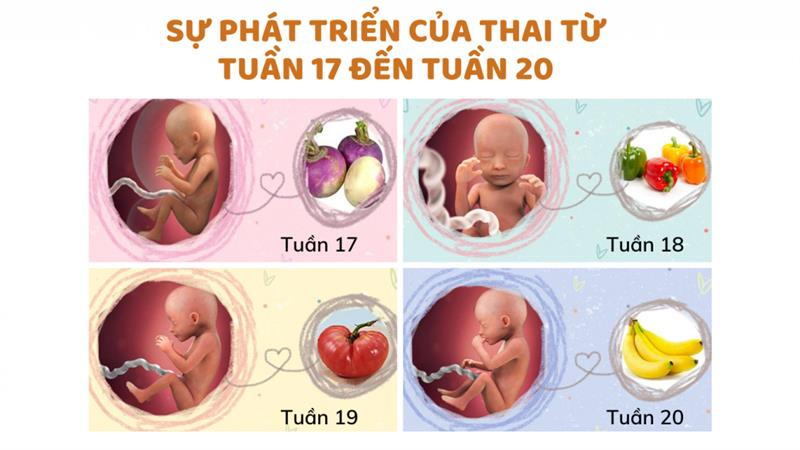

# Tuần 18

***Mang thai tháng thứ 5: Mẹ cần lưu ý những gì?***  
*23:13:11 02-11-20222 phút đọc2k*  
***1\. Sự phát triển của thai nhi tháng thứ 5***  
*Ở tháng thứ 5 (từ tuần 17 đến tuần 20), thai nhi phát triển rất nhanh, kích thước có thể lên đến 15-16 cm và nặng từ 300-400g. Các cơ quan của trẻ đã bắt đầu phát triển rõ ràng. Nhiều chức năng của cơ thể thai nhi đã hoạt động như trẻ sơ sinh. Hệ xương và cơ cũng đang dần hoàn thiện nên nhu cầu dinh dưỡng rất lớn.*  
*Những bước phát triển của thai nhi trong tháng thứ 5:*  
*\- Tay chân đã được hình thành, tất cả các khớp đã cử động linh hoạt.*   
*\- Bé cử động hăng hái hơn rất nhiều, có thể xoay người trong nước ối và đá vào thành tử cung. Vị trí thai nhi trong bụng mẹ còn chưa cố định và thay đổi liên tục.*  
*\- Thai nhi bắt đầu tích “mỡ nâu” làm nhiệm vụ điều chỉnh thân nhiệt sau khi sinh.*   
*\- Mạng lưới dây thần kinh phát triển mạnh, bé cảm nhận được những kích thích đối với cơ thể.*   
*\- Thính giác phát triển hơn, bé cảm nhận rõ hơn những âm thanh từ bên ngoài.*  
*\- Phân su bắt đầu tích lại.*  
  
*Hình dung kích thước thai nhi qua các tuần thai ở tháng thứ 5\.*  
***2\. Mang thai tháng thứ 5, cơ thể mẹ bầu thay đổi như thế nào?***  
*Tháng thứ 5, bụng mẹ nhô lên và rất “ra dáng” một mẹ bầu. Cơ thể bắt đầu chuẩn bị từng chút một để sẵn sàng với thiên chức làm mẹ.*  
*Những thay đổi mẹ có thể cảm nhận rõ khi mang bầu tháng thứ 5:*  
*\- **Trở nên tròn trịa hơn**: cơ thể mẹ sẽ sử dụng chất béo để cung cấp năng lượng thay thế cho đường. Chính vì vậy lớp mỡ dưới da được tích tụ thêm. Lúc này, tử cung to bằng kích thước đầu của một em bé, bụng nhô ra rõ ràng.*   
*\- **Bầu ngực to lên, sậm màu hơn**: điều này do tuyến sữa đang dần phát triển để chuẩn bị cho việc sinh nợ.*  
*\- **Tim đập nhanh hơn**: do vừa phải phục vụ cho cơ thể ngày càng nặng của mẹ vừa phải bơm chất dinh dưỡng cho thai nhi. Vì vậy, mẹ bầu dễ cảm thấy uể oải, dễ mệt mỏi hơn.*  
*\- **Dễ cảm thấy đau lưng**: do cơ thể mẹ đang chuẩn bị cho sinh nở, xương chậu sẽ trở nên lỏng lẻo hơn, đồng thời, khối lượng phía thân trước nặng hơn khiến xương phải chịu nhiều lực hơn.*  
*\- **Mẹ cảm nhận rõ cử động của thai nhi** (thai máy): từ tuần 18 \- 20 bé vận động mạnh mẽ hơn, mẹ cảm nhận rõ ràng hiện tượng máy thai. Tuy nhiên, cách cử động của thai nhi hay cách cảm nhận sẽ khác nhau tùy mỗi người.*   
  
*Mang thai tháng thứ 5 cơ thể mẹ tròn trịa hơn.*  
***Ngoài ra, tương tự như ở tháng thứ 4, mẹ cũng gặp những triệu chứng như:***  
*\- Ợ nóng.*  
*\- Chuột rút chân, giãn tĩnh mạch.*  
*\- Vết rạn ở bụng.*  
*\- Bàn chân và mắt cá chân sưng tấy.*  
*\- Táo bón.*  
*\- Tăng chóng mặt, đau đầu, nghẹt mũi.*  
*\- Thay đổi da, có thể bị sạm nám (đặc biệt là sậm màu ở núm vú).*  
*\- Tiết sữa non (có mẹ tiết sữa non sớm từ tháng thứ 3).*  
***3\. Mẹ bầu nên ăn gì ở tháng thứ 5?***  
*Mang thai tháng thứ 5, thể trạng của nhiều mẹ đã ổn định. Đây là thời kỳ ốm nghén thuyên giảm đáng kể, mẹ có cảm giác thèm ăn hơn. Từ sau tháng thứ 3, mỗi tháng mẹ cần tăng khoảng 1,5 \- 2kg, nếu nằm ngoài khoảng này là một dấu hiệu bất thường.*   
*Theo đó, trong khẩu phần ăn của bà bầu cần cung cấp đủ 4 nhóm thực phẩm: tinh bột, protein, chất béo, các Vitamin và khoáng chất.*   
*Mẹ bầu cần chú ý bổ sung từ 2-2.5 lít nước mỗi ngày để không bị mất nước, táo bón, ảnh hưởng đến lượng nước ối và túi ối.*  
*Ở ba tháng giữa của thai kỳ, sự trao đổi chất tăng cao nên mẹ cần bổ sung thêm 300-350 calo mỗi ngày. Như vậy, tổng hàm lượng calo của chế độ ăn mỗi ngày có thể từ 2300 đến 2500 calo.*  
  
*Mẹ nên ăn đầy đủ các nhóm thực phẩm để đủ dưỡng chất cho thai nhi.*  
*Ngoài ra, mẹ cũng cần hạn chế các loại thực phẩm sau:*  
*\- Đồ uống có ga chứa cồn và chất kích thích.*  
*\- Hạn chế ăn thực phẩm tăng co bóp tử cung như: rau ngót, thơm, vải, nước dừa.*  
*\- Thức ăn nhiều calo, đồ chiên rán nhiều dầu mỡ, đồ ăn nhanh vì chúng sẽ gây béo phì và có thể gây biến chứng cho thai nhi.*  
***4\. Chế độ sinh hoạt cho mẹ bầu 5 tháng***  
***4.1. Tư thế ngủ phù hợp khi mang thai tháng thứ 5***  
*Khi ngủ mẹ bầu nên kê cao chân nếu thường xuyên bị chuột rút hoặc mắc các bệnh liên quan đến tĩnh mạch. Bà bầu mắc bệnh trào ngược dạ dày nên nằm đầu cao, lưng cao để hạn chế tình trạng trào ngược axit.*  
  
*Nằm nghiêng được xem là tư thế được khuyến khích cho bà bầu để tạo sự thoải mái.*  
***4.2. Tập các bài nhẹ nhàng để nâng cao thể lực***  
*Nếu được sự cho phép của bác sĩ thì có thể bắt đầu các môn thể thao dành riêng cho bà bầu như: đi bộ, yoga, bài tập kéo giãn cơ, bơi lội,...*  
***4.3. Chăm sóc vết rạn da***  
*Rạn da khi mang thai thường xuất hiện rất rõ từ tháng thứ 5, khi mẹ tăng cân nhanh hơn so với độ đàn hồi của da. Mẹ bầu nên bôi kem dưỡng ẩm đều đặn lên vùng da bị rạn hoặc vùng da có thể bị rạn như: bụng, ngực, mông, đùi, bắp chân.*  
***4.4. Thai giáo tháng thứ 5***  
*Phương ngoài trò chuyện và cho bé nghe nhạc, ở tháng thứ 5 bố mẹ có thể thai giáo bằng các phương pháp như đọc sách, chơi các trò chơi trí tuệ (ghép hình, tô màu, sudoku,...). Ngoài ra, phương pháp thiền và sử dụng trí tưởng tượng cũng tốt cho trí não thai nhi và giúp mẹ ổn định cảm xúc.*   
***5\. Các dấu hiệu nguy hiểm cần đi khám ngay***  
*Mang thai tháng thứ 5, ngoài những thay đổi kể trên về ngoại hình cũng như nền tảng nội tiết tố của thai phụ. Nếu xuất hiện những biểu hiện bất thường sau đây, bạn nên đến bệnh viện để thăm khám kịp thời. Cụ thể, các triệu chứng là:*  
*\- Chóng mặt, choáng váng, thị lực kém.*  
*\- Đau vùng thượng vị.*  
*\- Tiết dịch âm đạo với nhiều chất nhờn.*  
*\- Chân sưng phù và xuất hiện chuột rút nhiều lần.*  
*\- Bụng căng cứng, đau buốt bụng dưới, khó thở.*  
*\- Đau bụng và ra máu tăng dần.*   
*Trên đây là những thay đổi của mẹ và thai nhi trong tháng thứ 5 của thai kỳ. Mẹ hãy chú ý để kịp thời phát hiện những bất thường để có hướng xử lý đúng đắn. Chúc mẹ có một thai kỳ an toàn và khỏe mạnh\!*
