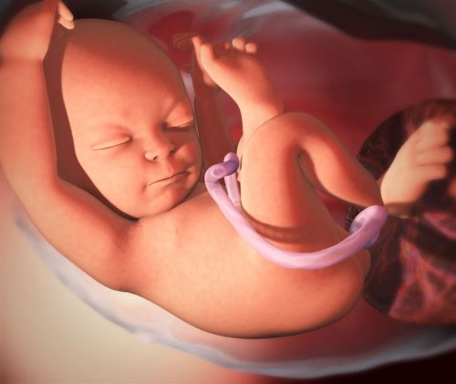

# Tuần 19

***15 lời khuyên cho bà bầu khi đi du lịch***    
*10:26:30 26-10-20212 phút đọc2k*  
***1\. Đi du lịch khi bạn thấy thoải mái nhất***  
*Thời điểm tốt nhất để phụ nữ mang thai đi du lịch là từ tuần 14 đến tuần 28, hay trong 3 tháng giữa thai kỳ. Các vấn đề phổ biến nhất khi mang thai xảy ra trong 3 tháng đầu và 3 tháng cuối của thai kỳ. Nếu bạn có thể lựa chọn linh hoạt ngày đi du lịch của mình, thì nên sắp xếp lịch vào những tháng giữa thai kỳ để bản thân có một trải nghiệm thú vị.*  
***2\. Nhận lời khuyên từ bác sĩ sản khoa***  
*Mặc dù bạn chọn thời điểm an toàn trong thai kỳ để đi du lịch thì cũng nên gặp bác sĩ của mình để tham khảo ý kiến về chuyến đi và lên lịch cụ thể để tránh ảnh hưởng tới lịch khám thai, xét nghiệm định kỳ. Ngoài ra, hãy dành thời gian để nghiên cứu các cơ sở y tế gần nơi bạn sẽ tới, vì chắc chắn sẽ không ai muốn phải cuống cuồng tìm một cơ sở y tế nếu bạn gặp biến chứng trong chuyến đi.*  
*Việc lập kế hoạch sớm có thể bao gồm việc kiểm tra các bệnh viện lân cận mà bạn liên hệ trước chuyến đi, tìm các hiệu thuốc và các nguồn thông tin bổ sung trước khi sinh ở nơi bạn đến nếu bạn chuyển dạ sớm.*  
  
*Trước chuyến đi du lịch bạn nên tham khảo ý kiến bác sĩ để nhận được sự tư vấn bổ ích.*  
***3\. Mua bảo hiểm du lịch***  
*Bạn nên mua bảo hiểm du lịch bao gồm bảo hiểm y tế trước chuyến đi nếu bạn đang đến thăm một điểm đến mà bảo hiểm y tế của bạn sẽ không được áp dụng. Đặc biệt là trong những chuyến du lịch nước ngoài. Nếu bảo hiểm y tế thông thường của bạn không được tính ở đây thì bạn và người thân có thể gặp nhiều khó khăn trong việc đảm bảo sức khỏe cho bạn và em bé trong trường hợp đột xuất xảy ra. Do đó bạn cần tìm hiểu kỹ về vấn đề bảo hiểm y tế và bảo hiểm du lịch nhé\!*  
***4\. Mang theo hồ sơ y tế***  
*Bạn có thể yên tâm tiến hành mọi dịch vụ chăm sóc y tế bằng cách mang theo một bản sao hồ sơ y tế liên quan đến thai kỳ trong chuyến đi của mình. Những cơ sở y tế bạn tới sẽ căn cứ vào hồ sơ y tế cũng như sổ tay thai sản của bạn để có những chẩn đoán và điều trị kịp, đảm bảo sức khỏe cho mẹ và bé được an toàn trong thời gian nhanh nhất.*   
***5\. Chủ động về nâng cao sức khỏe***   
*Khi mang thai, bạn nên thực hiện các phương pháp tập luyện nhẹ nhàng để tránh các vấn đề về sức khỏe bất kể bạn đang đi du lịch hay ở nhà. Nguyên nhân là vì phụ nữ mang thai có nguy cơ bị đông máu cao hơn và việc ngồi lâu sẽ làm tăng nguy cơ đó. Do đó, bạn nên cố gắng đứng dậy và đi bộ từ 5 đến 10 phút sau mỗi vài giờ, ngay cả khi bạn đang trên máy bay.*  
*Bạn cũng có thể nhờ sự hỗ trợ tư vấn của bác sĩ về việc mua và mang vớ nén trong quá trình di chuyển khi đi du lịch, điều này có thể giúp bạn tránh bị sưng tấy, đông máu.*  
***6\. Uống đủ nước***  
*Mất nước có thể khiến bạn cảm thấy mệt mỏi, môi khô và bong tróc, bên cạnh đó là thiếu nước thì bạn có nguy cơ mắc các cơn co thắt trước khi sinh gây nguy hiểm cho thai nhi. Do đó trong quá trình đi du lịch bạn  hãy mang theo chai nước bên cạnh để cơ thể luôn được cung cấp đủ nước. Nếu mẹ không uống nước lọc thì có thể thay bằng nước ép trái cây hoặc sinh tố và chia đều ra trong ngày.*   
***7\. Mang theo những đồ ăn nhẹ bên mình***  
*Các sân bay, trạm xe, bến tàu...không phải lúc nào cũng có nhiều lựa chọn ăn uống phù hợp với bà bầu và giá tại những nơi này cũng không phải ré . Để tiết kiệm tiền chi phí và tránh phải ăn uống những thực phẩm lạ, không đầy đủ chất dinh dưỡng, bạn có thể mang đồ ăn nhẹ phù hợp với sở thích và sức khỏe của bản thân.*  
*Cân nhắc đóng gói đồ ăn nhẹ tốt cho sức khỏe như trái cây khô, rau quả và bánh ăn cho bà bầu được làm từ ngũ cốc nguyên hạt. Những thực phẩm này rất phù hợp khi bạn cảm thấy buồn nôn hoặc không khỏe, những bánh này cũng nhỏ gọn dễ dàng đóng gói trong túi và mang theo.*  
***8\. Mang theo khăn và gel khử trùng***  
*Rửa tay thường xuyên là cách tốt nhất để giúp loại bỏ bớt các vi khuẩn và virus bán trên tay. Đặc biệt là chúng ta đã trải qua những tháng ngày sống chung với covid \-19, thì ta thấy rằng việc rửa tay quan trong như thế nào. Bên cạnh đó khi dùng khăn hay gel rửa tay có chứa cồn kháng khuẩn cũng giúp xua đuổi những côn trùng gây hại. Bạn cũng có thể dùng khăn và gel để vệ sinh những vật dụng hoặc nơi mà bạn tiếp xúc.*  
*Bạn đừng quên rửa tay sạch sẽ trước khi ăn hoặc chế biến thức ăn nhé\!*  
***9\. Chia nhỏ thời gian trong chuyến đi***  
*Nếu bạn đang lên kế hoạch cho một chuyến đi du lịch xa mà cần lái xe một quãng đường dài để đến đích, thì bạn có thể chia nhỏ đoạn đường đi, có thể tăng thêm thời gian. Bằng cách đó, bạn sẽ chỉ phải ngồi trong một khoảng thời gian ngắn hơn thay vì kéo dài thời gian khiến bạn dễ bị sưng tấy bàn chân, đông máu và các biến chứng liên quan đến thai kỳ khác.*  
*Trong chuyến đi bạn nên thắt dây an toàn ở vị trí thấp trên xương hông, dưới bụng và "đặt đai vai lệch sang một bên bụng và ngang giữa ngực.*  
*Lên kế hoạch dừng lại thường xuyên để có thể ra ngoài và duỗi chân, việc dừng nhiều lần tại nhiều địa điểm khác nhau vừa giúp chuyển đi thú vị hơn vừa giúp giữ an toàn cho hai mẹ con.*  
  
*Trong chuyến đi du lịch bạn nên chia nhỏ thời gian để cơ thể thường xuyên được nghỉ ngơi.*  
***10\. Đặt chỗ ngồi sát lối đi nếu phương tiện du lịch là máy bay***  
*Nếu bạn dự định bay khi đang mang thai, hãy đặt chỗ ngồi ở sát lối đi ở giữa \- ngay cả khi bạn phải trả thêm tiền. Việc ngồi gần ở lối đi sẽ giúp bạn đứng dậy và đi lại dễ dàng hơn, cũng như đi vào nhà vệ sinh trong nhiều nhiều lần một cách dễ dàng và an toàn.*  
***11\. Đừng đặt tham quan nhiều điểm cùng một lúc***  
*Ngắm cảnh sẽ mang lại nhiều niềm vui cho bà bầu, nhưng bạn đừng quên rằng năng lượng có thể bị bị ảnh hưởng trước khi khởi hành.*  
*Bạn hãy đảm bảo lên kế hoạch chuyên du lịch của mình có nhiều thời gian nghỉ ngơi và thời gian dừng chân. Những nơi có phương tiện di chuyển tiện lợi, y tế phát triển và địa điểm nghỉ dưỡng hiện đại có các spa chăm sóc cơ thể hay một khu nghỉ mát trọn gói.*  
***12\. Hãy lựa chọn kỹ lưỡng về điểm đến của bạn***  
*Hãy lưu ý tới thời tiết, khí hậu tại nơi mà bạn tới và cách chúng có thể tác động tới sức khỏe của bạn và em bé. Nếu bạn đang lên kế hoạch cho một nơi nghỉ ngơi trên bãi biển vào giữa tháng 10 thì nên xem xét tới mùa mưa ở miền Nam và có thể có bão ở miền Bắc, hay đi Sapa thì mùa đông sẽ đẹp nhưng liệu bạn có chịu được mùa không hay không? Do đó cần nghiên cứu kỹ địa điểm đi và thời tiết nơi đó để giúp bạn tìm thấy một điểm đến có thời tiết tốt hơn, ẩm thấp tốt cho sức khỏe của mẹ và em bé.*  
*Khi nói đến lập kế hoạch chuyến đi, Google là người bạn của bạn. Hãy chắc chắn rằng bạn biết thời tiết như thế nào cho dù bạn định đi du lịch ở đâu nếu không bạn có thể sống để hối tiếc.*  
  
*Xem xét về địa điểm tới và thời tiết ở những nơi đó để có chuyến đi tuyệt vời.*  
***13\. Mang theo bộ sơ cứu***  
*Không có gì tồi tệ hơn việc phải di chuyển hàng giờ mà không có sự hỗ trợ cần thiết cho bệnh đau đầu, ợ nóng và các bệnh liên quan đến thai kỳ khác. Nếu bạn cảm thấy không khỏe khi chuẩn bị đi du lịch hay dự phòng cho những tình huống xấu thì bạn nên mang theo một bộ sơ cứu nhỏ.*  
*Hãy cân nhắc mang theo thuốc trị ợ chua, đầy hơi và buồn nôn \- hoặc bất cứ thứ gì khiến bạn khó chịu trong bộ sơ cứu của mình.*  
***14\. Kiểm tra xem bạn có cần thông quan để bay không***  
*Trong khi hầu hết các hãng hàng không cho phép bạn bay cho đến khi bạn mang thai được 36 tuần, một số hãng hàng không khác có thể là hơn 30 tuần là bạn không được lên máy bay nữa. Bên cạnh đó các hãng hàng không cần có xác minh sức khỏe và giấy chứng nhận y tế từ bác sĩ trước khi bạn lên máy bay.*   
*Nếu bạn dự định bay trong nước hoặc nước ngoài, hãy nhớ kiểm tra với các hãng hàng không mà bạn đang cân nhắc khi tổ chức chuyến đi du lịch. Hầu hết các hãng hàng không thường liệt kê thông tin này trên trang web của họ, nhưng bạn cũng có thể gọi điện để hỏi xem bạn có cần bất kỳ giấy tờ cụ thể nào không.*  
  
*Tìm hiểu trước chính sách của các hãng máy bay đối với phụ nữ mang thai.*  
***15\. Mang theo số lượng hành lý phù hợp***  
*Cuối cùng, đừng quên mang theo hành lý để dễ dàng di chuyển từ nơi này sang nơi khác. Hành lý cần nên đựng trong vali có bánh xe để dễ vận chuyển và nên cố gắng đóng gói nhẹ nhàng với những quần áo, đầm váy và giày dép phù hợp cho chuyển đi.*
