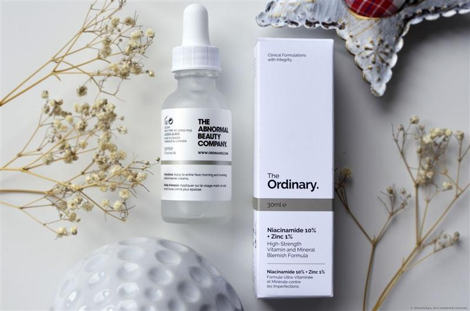

# Tuần 21

***Bầu có trị mụn được không? Có được dùng retinol không?***  
*01:31:37 05-07-20242 phút đọc2k*  
*Trong thời kỳ mang thai, cơ thể mẹ bầu trải qua nhiều thay đổi lớn, và làn da cũng không ngoại lệ. Mụn trứng cá là vấn đề phổ biến mà nhiều mẹ bầu phải đối mặt do sự thay đổi hormone. Câu hỏi đặt ra là: liệu bầu có trị mụn được không? Và đặc biệt, mẹ bầu có được dùng retinol không?*  
***Trị mụn khi mang thai: Có nên không?***  
*Việc trị mụn khi mang thai hoàn toàn có thể thực hiện được, nhưng cần lưu ý và chọn lựa phương pháp an toàn cho cả mẹ và bé. Mẹ bầu nên tránh các sản phẩm chứa hóa chất mạnh, bởi da lúc này rất nhạy cảm và dễ phản ứng.*  
***Có được dùng retinol không?***  
*Retinol là một dẫn xuất của vitamin A, thường được sử dụng trong các sản phẩm chống lão hóa và trị mụn. Tuy nhiên, retinol không được khuyến khích sử dụng trong thai kỳ. Lý do là các nghiên cứu đã chỉ ra rằng **retinol có thể gây ra các biến chứng và dị tật bẩm sinh cho thai nhi.** Vì vậy, mẹ bầu nên tránh hoàn toàn các sản phẩm chứa retinol trong suốt quá trình mang thai.*  
  
*Mẹ bầu tuyệt đối không nên dùng retinol, cả dạng bôi và uống, đặc biệt trong 3 tháng đầu thai kỳ, vì có thể gây hại cho thai nhi.*  
***Những lựa chọn an toàn để trị mụn cho mẹ bầu***  
*Mặc dù retinol không an toàn, mẹ bầu vẫn có nhiều cách khác để trị mụn một cách an toàn và hiệu quả trong thai kỳ:*  
*\- **Sử dụng sản phẩm chứa axit salicylic nồng độ thấp:** Axit salicylic ở nồng độ thấp (dưới 2%) được coi là an toàn cho mẹ bầu. Nó giúp làm sạch lỗ chân lông và giảm viêm nhiễm.*  
*\- **Benzoyl peroxide:** Ở nồng độ thấp, benzoyl peroxide có thể được sử dụng nhưng nên hỏi ý kiến bác sĩ trước khi sử dụng.*  
*\- **Sản phẩm chứa axit alpha hydroxy (AHA):** Các axit như glycolic acid và lactic acid giúp tẩy tế bào chết và làm sạch da một cách nhẹ nhàng.*  
*\- **Tinh dầu tràm trà (tea tree oil):** Đây là một lựa chọn tự nhiên giúp kháng khuẩn và giảm viêm hiệu quả.*  
  
*Serum The Ordinary trị mụn, trị thâm cho bà bầu*   
*Ngoài việc sử dụng các sản phẩm trị mụn, mẹ bầu cũng nên chú ý đến các thói quen chăm sóc da hàng ngày để giữ làn da khỏe mạnh:*  
*\- **Rửa mặt hai lần mỗi ngày:** Sử dụng sữa rửa mặt dịu nhẹ, không chứa cồn và hóa chất mạnh.*  
*\- **Dưỡng ẩm:** Dùng kem dưỡng ẩm phù hợp để giữ da mềm mịn và ngăn ngừa tình trạng khô ráp.*  
*\- **Uống đủ nước:** Giúp cơ thể thải độc và giữ ẩm cho da từ bên trong.*  
*\- **Chế độ ăn uống lành mạnh:** Ăn nhiều rau xanh, trái cây và thực phẩm giàu omega-3 để cải thiện làn da.*  
*Dù mụn trứng cá có thể gây khó chịu và làm mất tự tin, nhưng sức khỏe của mẹ và bé luôn là ưu tiên hàng đầu. Mẹ hãy lưu ý chọn những phương pháp an toàn, tự nhiên và luôn tham khảo ý kiến của bác sĩ trước khi sử dụng bất kỳ sản phẩm nào.*  
*Chúc các mẹ bầu có một thai kỳ khỏe mạnh, hạnh phúc và luôn tự tin với làn da của mình\!*
