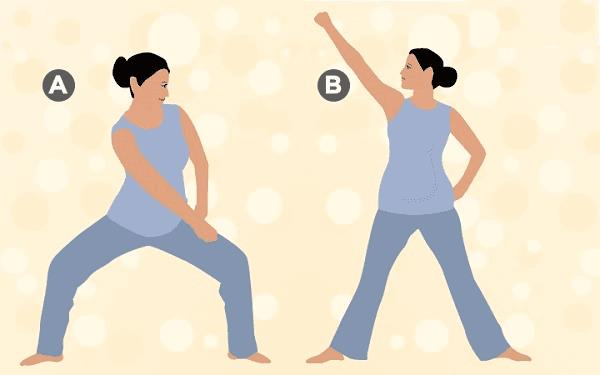

# Tuần 22

***Năm bài tập thể dục cho mẹ bầu: đơn giản, nhẹ nhàng, an toàn***  
*09:28:17 27-10-20212 phút đọc2k*  
***Tác dụng của việc tập thể dục trong thai kỳ***  
*Theo hướng dẫn mới nhất của Hiệp hội Sản phụ khoa Mỹ (ACOG), phụ nữ mang thai nên tập thể dục thường xuyên đều đặn mỗi ngày kể cả trước, trong và sau sinh em bé ([1](https://www.acog.org/news/news-releases/2020/03/acog-releases-updated-guidance-on-exercise-in-pregnancy-and-postpartum)). Thời gian cho một buổi tập kéo dài từ 20 – 30 phút, đều đặn hầu hết các ngày trong tuần. Thể dục trong thai kỳ được khuyến nghị cho bất kỳ thai kỳ nào không kèm yếu tố nguy cơ cao, bao gồm cả những sản phụ thừa cân béo phì, ít hoạt động trước đó. Việc tập thể dục trong thai kỳ mang lại nhiều lợi ích tuyệt vời như:*  
*\- Giúp bạn khỏe mạnh.*  
*\- Giảm nguy cơ tiền sản giật do tình trạng tăng huyết áp – được xem là thai kỳ nguy cơ cao, giảm nguy cơ mổ lấy thai.*   
*\- Kiểm soát cân nặng hiệu quả.*  
*\- Giảm đau lưng – là một vấn đề thường gặp trong thai kỳ do thay đổi cân nặng và độ cong sinh lý của cột sống.*  
*\- Giúp làm quen với sự thay đổi vóc dáng, lấy lại vóc dáng nhanh sau sinh.*   
*\- Giúp tăng cường sức chịu đựng khi sinh.*   
*\- Giúp ngủ ngon.*   
*\- Giảm lo lắng trước sinh và trầm cảm sau sinh.*   
***1\. Yoga (chọn lọc động tác)***  
*Khi bạn bước vào tam nguyệt cá thứ hai của thai kỳ, em bé của bạn phát triển nhanh chóng, và sẽ tạo áp lực lên tử cung, lưng và cột sống của bạn. Do đó, hãy chuẩn bị tinh thần để đối phó với chứng đau lưng, chuột rút và sưng mắt cá chân trong tam cá nguyệt này. Mặc dù yoga không thể loại bỏ hoàn toàn cơn đau này, nhưng nó có thể giúp bạn giảm bớt nó ở một mức độ nào đó.*  
*Yoga rất có ích cho những phụ nữ mang thai. Tập yoga có thể giúp bạn chuẩn bị tinh thần và cơ thể cho quá trình chuyển dạ và sinh nở vì điều này giúp bạn tập trung và giữ cho bạn khỏe mạnh. Ngoài ra, yoga giúp bạn điều chỉnh các nhu cầu thể chất của quá trình mang thai, chuyển dạ, sinh nở và làm mẹ. Nó làm dịu cả tâm trí lẫn cơ thể, giảm căng thẳng về thể chất và cảm xúc mà cơ thể bạn cần trong suốt thai kỳ. Thậm chí một số tư thế còn có thể giúp bạn đỡ đau hơn trong quá trình chuyển dạ sinh em bé, hoặc giảm nguy cơ sinh mổ.*  
  
*Tập yoga có thể giúp bạn chuẩn bị tinh thần và cơ thể cho quá trình chuyển dạ sắp tới.*  
*Tuy nhiên khi lựa chọn tập yoga bạn phải lựa chọn những động tác phù hợp vì trong yoga có nhiều động tác và trường phái tập không phù hợp cho mẹ bầu, đôi lúc là gây nên những nguy hiểm đáng tiếc. Do đó để chắc chắn mẹ nên tham khảo ý kiến bác sĩ và các chuyên gia hướng dẫn để có sự lựa chọn thích hợp với cơ thể. Ngoài ra bạn có thể tham khảo bài viết “các tư thế yoga mẹ bầu nên tránh tập khi mang thai” của chúng tôi để có thêm thông tin.*  
***Một số động tác yoga phù hợp cho mẹ bầu:***  
***a. Tư thế núi (Tadasana)***  
*Tư thế yoga này thường được thực hiện vào buổi sáng. Nếu mẹ bầu thực hiện nó sau các tư thế khác, khi bụng đói. Tư thế núi giúp cải thiện lưu thông máu, cải thiện tư thế và tăng cường sức mạnh cho đùi và chân, đồng thời nó cũng giúp giảm đau lưng hiệu quả.*  
***Thực hiện:***  
*\- Đứng thẳng và đưa hai bàn chân rộng bằng hông.*  
*\- Trong khi đứng, cột sống của bạn phải dựng thẳng, hai tay ôm sát cơ thể và lòng bàn tay úp vào đùi.*  
*\- Hít sâu, duỗi thẳng cột sống và nâng cao tay lên trên đầu.*  
*\- Duỗi lưng và ngửa đầu ra sau để có thể nhìn vào các đầu ngón tay.*  
*\- Giữ tư thế này trong 10-15 giây, sau đó thở ra từ từ và trở lại vị trí bình thường.*   
***Lưu ý:** Hít bằng mũi rồi thở ra qua miệng, thở chậm và sâu. Không để phần lưng chịu tải trọng cơ thể quá nặng và luôn giữ cho hai bờ vai thật thoải mái.*  
***b. Tư thế chiến binh (Virabhadrasana)***  
*Tư thế giúp tăng cường sức mạnh cho lưng, vai, bắp chân, mắt cá chân và đùi. Đồng thời cải thiện sự cân bằng và tăng sức chịu đựng.*  
***Thực hiện:***  
*\- Bạn đứng thẳng, hai tay và hai chân dang rộng.*  
*\- Từ từ hạ thấp gối phải, bàn chân phải hướng ra ngoài.*  
*\- Đầu xoay sang phải, mắt nhìn theo tay phải.*  
*\- Giữ tư thế trong 20 giây và lặp lại cho bên còn lại.*  
***Lưu ý:***   
*\- Nếu bạn đang bị tiêu chảy hoặc tăng huyết áp thì không nên tập động tác này.*  
*\- Nếu mẹ bầu tập tư thế này trong 3 tháng tháng cuối thai kỳ và cảm thấy khó chịu thì nên dừng lại và đổi tư thế khác.*  
*\- Trong quá trình tập phải hít thở đều và thấy cơ thể mệt nên dừng lại ngay.*  
***2\. Bơi lội***  
*Đây được xem là môn thể thao lý tưởng cho mẹ bầu. Bơi lội là một bài tập ít tác động đến khớp và dây chằng của bạn vì nước hỗ trợ cơ thể bạn. Bơi lội cũng là một bài tập thể dục nhịp điệu và điều hòa sức bền. Cả hai yếu tố này đã được chứng minh là giúp rút ngắn thời gian chuyển dạ  và giảm nguy cơ biến chứng khi sinh.*  
*Không chỉ hỗ trợ cho hệ tuần hoàn, bơi lội thường xuyên sẽ giúp cải thiện độ săn chắc của cơ và tăng sức bền của bạn. Môn thể thao này cũng có thể cung cấp cho bạn nhiều năng lượng hơn và giúp bạn ngủ ngon hơn.*  
*Nếu bạn đã quen với việc bơi lội trước khi mang thai, hãy dành khoảng 4 ngày một tuần, mỗi ngày 30 phút. Nếu bạn là người mới làm quen hoặc chưa từng bơi nhiều, hãy bắt đầu từ từ với 15 phút mỗi lần và xây dựng dần dần. Một số phụ nữ lo lắng rằng các hóa chất khử trùng bể bơi có thể gây hại cho em bé của, nhưng không có bằng chứng nào cho thấy em bé của bạn có thể gặp nguy hiểm.*  
  
*Bơi lội là môn thể thao lý tưởng cho mẹ bầu.*  
***3\. Đi bộ***  
*Đi bộ là hoạt động tốt cho mẹ bầu tăng cường hoạt động cho tim và phổi mà không làm đau đầu gối hay mắt cá chân. Mẹ có thể đi bộ cho đến ngày chuyển dạ. Để có thêm động lực tập luyện, hãy đi dạo với bạn bè và gia đình. Điều này có thể giúp kéo dài thời gian và khuyến khích bạn đi bộ trong thời gian dài hơn. Đừng quên trang bị cho mình một đôi giày và bộ đồ thoải mái, uống nước cả trước, trong, sau khi đi bộ để tránh mất nước cho cơ thể.*  
*Nếu bạn mới bắt đầu làm quen với việc đi bộ hãy bắt đầu với 15 phút mỗi ngày và tần suất 3 lần/tuần. Khi bạn đã hình thành thói quen đi bộ thường xuyên, bạn có thể tăng tần suất 4-5 lần/tuần. Tuy nhiên, bạn cần lưu ý giảm tốc độ hoặc dừng lại nếu cảm thấy mệt mỏi hoặc đau.*   
*Không khí trong lành sẽ làm cho tinh thần của bạn sảng khoái. Trong khi nhịp điệu đi bộ sẽ mang lại cho bạn sự tập luyện nhẹ nhàng cần thiết. Bạn có thể tiếp tục đi bộ ngay cả sau khi sinh bé.*  
***4\. Pilates (chọn lọc động tác) – Cách để mẹ và bé khỏe mạnh***  
*Pilates liên quan đến một loạt các chuyển động giúp cải thiện sức mạnh và khả năng phối hợp của các bộ phận, giúp cơ thể khỏe mạnh, linh hoạt và cân đối. Hầu hết các bài tập pilates giúp tăng cường cơ bụng, cũng như cơ sàn chậu. Cả hai cơ này đều trải qua nhiều hao mòn khi mang thai. Vì vậy, đây là môn thể thao tuyệt vời để thực hiện khi mang thai, mặc dù một số bài tập sẽ cần được chuyên gia điều chỉnh khi bạn gần đến ngày dự sinh.*  
***Lưu ý:** Pilates được thực hiện tốt nhất với một chuyên gia được đào tạo, đặc biệt nếu bạn chưa quen với nó. Giáo viên có thể giúp bạn điều hướng các bài tập và đạt được hiệu quả tối đa. Trước khi tham gia khóa tập bạn cũng nên tham khảo ý kiến bác sĩ về sức khỏe thai kỳ và sự phát triển của em bé trong bụng.*  
***Dưới đây là những bài tập Pilates tốt nhất cho bà bầu:***  
***a. Bài tập thanh kiếm***  
*Bài tập tuyệt vời này sẽ khiến bạn cảm thấy như một chiến binh\! Khi mang thai, sự cân bằng của bạn trở nên khó khăn hơn một chút do việc tăng cân. Thanh kiếm là một bài tập tuyệt vời để giữ cho cơ thể của bạn trong tư thế cân bằng.*  
*Bài tập cũng là một cách tuyệt vời để tăng cường cơ bắp chân cũng như lưng và cơ bụng. Tất cả đều có ích trong quá trình chuyển dạ và sinh nở. Các kỹ thuật thở đi kèm với bài tập này cũng sẽ giúp bạn điều hòa nhịp thở, đặc biệt là khi chuyển dạ.*  
***Cách thực hiện:***  
*\- Đứng hai chân cách xa nhau, rộng hơn hông.*  
*\- Cong đầu gối của bạn và di chuyển bàn tay phải về phía đầu gối trái như trong hình.*  
*\- Bây giờ, giơ tay phải của bạn lên phía bên phải, giống như bạn sẽ lấy một thanh kiếm ra khỏi đai hông. Tiếp tục nhìn vào bàn tay trong khi làm như vậy.*  
*\- Lặp lại tương tự với bên trái của bạn.*  
  
*Bài tập thanh kiếm.*  
***b. Bài tập vẫy đuôi***  
*Bài tập này có cái tên khá ngộ nghĩnh. Nhưng nó là một bài tập tuyệt vời, là một trong những tốt nhất, cho phụ nữ mang thai.*  
*Bài tập này giúp tăng cường sức mạnh của lưng dưới cũng như cơ bụng. Hai bộ phận chịu nhiều tác động của gia tăng trọng lượng và kích thước thai kỳ. Bài tập cũng có tác dụng cải thiện sự linh hoạt và ổn định của cơ thể bạn.*  
***Cách thực hiện:***  
*\- Bắt đầu bằng cách quỳ và chống 2 tay xuống sàn. Giữ cho cổ tay của bạn thẳng hàng với vai.*  
*\- Hít bụng, nâng một đầu gối và thực hiện các chuyển động xoay tròn với chân.*  
*\- Lặp lại tương tự với một chân khác.*  
*\- Lặp lại ba đến bốn lần.*  
***5\. Bước thể dục nhịp điệu***  
*Bài tập này hoàn toàn đơn giản. Bước thể dục nhịp điệu phân là cách giúp bạn bước vào thói quen tập thể dục trong thai kỳ. Tập luyện giúp bạn giảm căng thẳng, ngủ ngon hơn và tăng sức chịu đựng. Động tác này cũng giúp cải thiện sự cân bằng và điều chỉnh nhịp thở. Điều mà bạn sẽ cần phải học để việc sinh em bé không gặp quá nhiều khó khăn.*  
***Một số lưu ý khác khi tập thể dục***  
*Bên cạnh đó, khi tập thể dục thể thao trong thai kỳ, mẹ bầu cần lưu ý:*   
*\- Tham khảo ý kiến bác sĩ trước khi lựa chọn môn tập.*  
*\- Thời gian tập khoảng 30 phút/lần.*  
*\- Tập đều đặn mỗi ngày hoặc 5-6 ngày/tuần.*  
*\- Luôn khởi động làm nóng trước khi tập.*  
*\- Không tập quá sức.*  
*\- Uống nhiều nước.*  
*\- Mặc đồ co giãn, thoải mái khi tập.*
