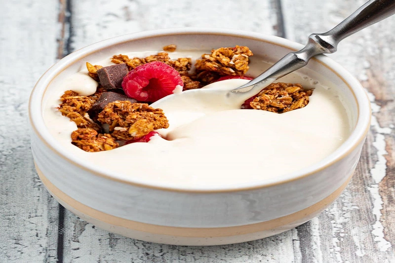
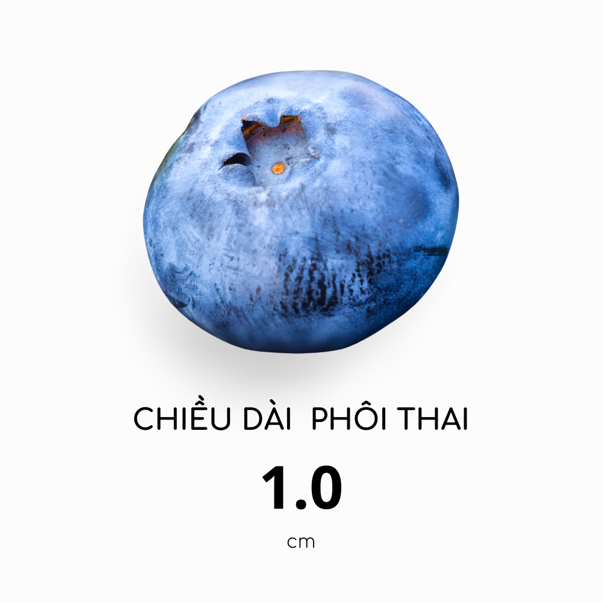
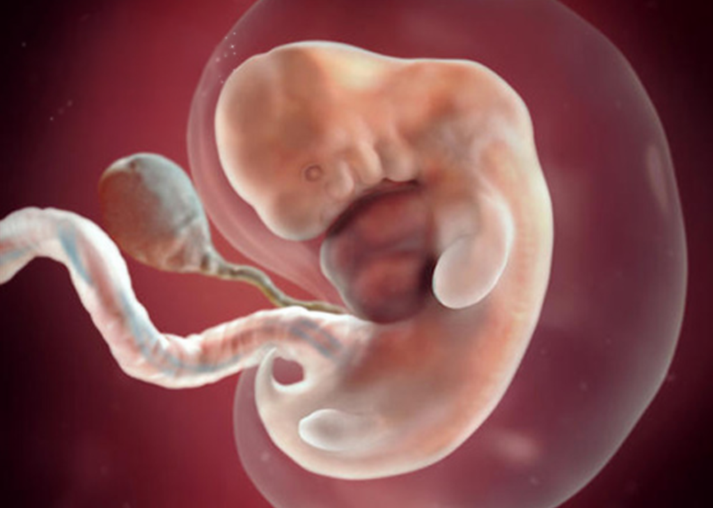
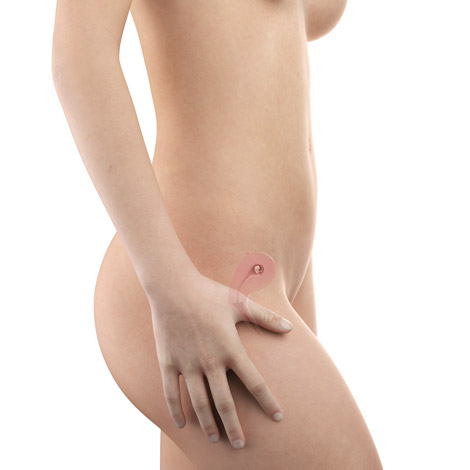

# Tuần 7

## **1\. Chán ăn khi mang thai: Nguyên nhân và cách khắc phục tình trạng "đói mà không muốn ăn"**

* 21:36:57 09-07-2024  
* 2 phút đọc  
* 2k

Mang thai là một giai đoạn đầy niềm vui nhưng cũng không ít thử thách, đặc biệt là khi mẹ bầu cảm thấy chán ăn khi mang thai. Tình trạng này khá phổ biến và có thể gây lo lắng cho cả mẹ và bố. Hãy cùng tìm hiểu nguyên nhân và cách khắc phục qua bài viết dưới đây để mẹ bầu có thể yên tâm hơn.

### **Nguyên nhân gây chán ăn khi mang thai**

#### **1\. Ốm nghén**

Ốm nghén là nguyên nhân hàng đầu khiến mẹ bầu cảm thấy đói nhưng không muốn ăn. Sự thay đổi nội tiết tố trong thai kỳ, đặc biệt là hormone Human Chorionic Gonadotropin (hCG), là nguyên nhân chính gây ra buồn nôn và thay đổi cảm giác thèm ăn. Đặc biệt trong tam cá nguyệt đầu tiên, mẹ bầu có thể gặp khó khăn trong việc duy trì chế độ ăn uống bình thường.

#### **2\. Rối loạn tiêu hóa**

Các vấn đề tiêu hóa cũng có thể khiến mẹ bầu mất cảm giác ngon miệng. Những triệu chứng như buồn nôn, nôn mửa, ợ nóng và táo bón đều ảnh hưởng đến khả năng ăn uống của mẹ.

\- **Buồn nôn và nôn mửa:** Đây là triệu chứng điển hình của ốm nghén, nhưng nếu xuất hiện trong giai đoạn cuối thai kỳ, mẹ cần chú ý đến các dấu hiệu khác để phân biệt với rối loạn tiêu hóa.

\- **Ợ nóng:** Trào ngược axit dạ dày do sự thay đổi nội tiết tố có thể gây cảm giác khó chịu và chán ăn.

\- **Táo bón:** Nếu mẹ bầu bổ sung sắt và canxi quá mức, táo bón có thể xảy ra, dẫn đến cảm giác no và không muốn ăn.

*Chán ăn khi mang thai do trào ngược dạ dày.* 

#### **3\. Nguyên nhân tiềm ẩn khác**

Ngoài những nguyên nhân trên, còn có một số nguyên nhân tiềm ẩn khác gây ra tình trạng chán ăn khi mang thai:

\- **Suy giáp:** Làm giảm cảm giác ngon miệng, khiến mẹ bầu không muốn ăn dù đói.

\- **Căng thẳng và thay đổi tâm lý:** Sự căng thẳng quá mức và thay đổi tâm lý trong thai kỳ có thể dẫn đến chán ăn. Nếu không được xử lý kịp thời, tình trạng này có thể dẫn đến trầm cảm, ảnh hưởng xấu đến sức khỏe của mẹ và bé.

\- **Hội chứng rối loạn ăn uống:** Một số mẹ bầu có thể mắc phải hội chứng này, gây ra sự chán ăn và mất cảm giác thèm ăn.

### **Chán ăn khi mang thai có nguy hiểm không?**

Hiện tượng đói bụng nhưng không muốn ăn khi mang thai nếu chỉ xảy ra trong thời gian ngắn, như trong tam cá nguyệt thứ nhất, thì thường không nguy hiểm. Tuy nhiên, nếu tình trạng này kéo dài và gây ra những triệu chứng nghiêm trọng như sụt cân đáng kể hoặc nôn mửa nhiều sau khi ăn, mẹ bầu nên đến gặp bác sĩ để được tư vấn và điều trị kịp thời.

### **Cách khắc phục tình trạng chán ăn khi mang thai**

#### **1\. Chia nhỏ bữa ăn**

Thay vì ép mẹ bầu ăn nhiều trong một lần, hãy chia thành nhiều bữa nhỏ, có thể từ 5-6 bữa mỗi ngày. Điều này giúp mẹ bầu dễ dàng tiêu hóa và hấp thụ dinh dưỡng hơn, đồng thời giảm cảm giác no và chán ăn.

#### **2\. Tránh thực phẩm không thích hoặc có mùi nồng**

Mẹ bầu nên tránh các món ăn có mùi nồng hoặc không thích, như cá, cà ri, đồ ăn nhiều dầu mỡ,... Những món ăn này có thể làm mẹ cảm thấy buồn nôn và chán ăn. Hãy lắng nghe cơ thể và ăn những món mẹ cảm thấy ngon miệng và dễ chịu.

*Mẹ nên ăn những món mẹ thèm nếu bị chán ăn khi mang thai.* 

#### **3\. Thay đổi cách chế biến**

Việc lặp lại thực đơn hàng ngày có thể khiến mẹ bầu cảm thấy chán ăn. Mẹ hãy thử thay đổi cách chế biến và thử nghiệm các công thức mới từ những thực phẩm lành mạnh. Các sách công thức dành riêng cho bà bầu có thể rất hữu ích trong việc mang lại sự đa dạng cho thực đơn của mẹ đấy. 

#### **4\. Luyện tập nhẹ nhàng**

Tập luyện nhẹ nhàng như đi bộ, yoga, hoặc bơi lội không chỉ giúp mẹ bầu tăng cường sức khỏe mà còn giảm các triệu chứng ốm nghén và tăng cảm giác thèm ăn. Nghiên cứu cho thấy, tập luyện hợp lý giúp cải thiện tâm trạng và thúc đẩy quá trình tiêu hóa, giúp mẹ bầu ăn uống ngon miệng hơn.

#### **5\. Tham khảo ý kiến bác sĩ dinh dưỡng**

Mỗi mẹ bầu có cơ địa và nhu cầu dinh dưỡng khác nhau, vì vậy việc tham khảo ý kiến bác sĩ dinh dưỡng là rất quan trọng. Bác sĩ sẽ đưa ra những lời khuyên và điều chỉnh chế độ ăn uống phù hợp, giúp mẹ bầu duy trì sức khỏe tốt nhất trong suốt thai kỳ.

#### **6\. Ăn vặt lành mạnh**

Mẹ bầu có thể bổ sung dinh dưỡng qua các món ăn vặt lành mạnh như phô mai, khoai lang sấy, sữa chua,... Những món ăn này không chỉ cung cấp dinh dưỡng cần thiết mà còn dễ ăn và ngon miệng, giúp mẹ bầu duy trì năng lượng và sức khỏe tốt.

*Các loại ngũ cốc như yến mạch, hạnh nhân, hạt bí, macca... có thể ăn trực tiếp hoặc trộn chung với sữa chua để mẹ bầu dễ ăn hơn.*

Chán ăn khi mang thai là một thử thách, nhưng với sự hiểu biết và những biện pháp khắc phục hợp lý, mẹ bầu hoàn toàn có thể vượt qua. Hãy luôn lắng nghe cơ thể và tìm kiếm sự hỗ trợ từ gia đình và bác sĩ để có một thai kỳ khỏe mạnh và hạnh phúc. Chúc mẹ bầu và bé luôn mạnh khỏe và bình an.

---

## **2\. Thai tuần thứ 7 phát triển ra sao và lời khuyên dành cho mẹ bầu**

* [Thai Kỳ](https://9thang10ngay.net/post/archive-layout1.html)  
* [Thai Kỳ Theo Tuần](https://9thang10ngay.net/post/archive-layout1.html)

* 20:06:03 11-04-2023  
* 2 phút đọc  
* 2k

### **1\. Dấu hiệu thai tuần thứ 7 khoẻ mạnh**

Bước sang tuần thứ 7, thai nhi phát triển nhanh chóng. Tay chân bắt đầu hình thành ngón, xương đuôi (phần mở rộng của xương cụt) dần co lại và biến mất.

Hệ thần kinh sơ khai được hình thành, các cơ quan nội tạng phát triển mạnh mẽ, mí mắt và ống thở xuất hiện.

#### **1.1. Kích thước thai tuần thứ 7**

Thai nhi của bạn lúc này còn rất nhỏ, có kích thước tương đương với một quả nho, chiều dài 1cm. 

*Chiều dài thai tuần thứ 7.*

#### **1.2. Sự phát triển của các bộ phận**

\- **Mắt**: phần giác mạc, mống mắt, đồng tử, thủy tinh thể và võng mạc bắt đầu phát triển trong tuần này. Mí mắt đang hình thành và che đi một phần mắt của em bé.

\- **Tai**: của em bé hình thành cả trong lẫn ngoài. 

\- **Đầu và mặt**: của em bé đang phát triển, lỗ mũi xuất hiện và thấu kính mắt cũng được hình thành. 

\- **Dạ dày, thực quản, gan, tuyến tuỵ**: bắt đầu hình thành và phát triển từ tuần này. 

\- **Cột sống và não** được hình thành từ ống thần kinh đã đóng lại ở cả hai đầu, với não của bé ở trên cùng. Não bộ phát triển rất nhanh, chia thành 3 phần: não trước, não giữa và não sau, và đáng kinh ngạc là mỗi phút tạo ra khoảng 250.000 tế bào nơ ron thần kinh. Còn phần xương đuôi đang co dần lại và sẽ sớm biến mất trong thời gian tới.

\- **Ngón tay, ngón chân**: bắt đầu phát triển từ bàn tay, bàn chân, chúng được bao bọc trong lớp màng. 

\- **Hệ thần kinh sơ khai**: đang được tạo thành từ các tế bào thần kinh tích cực phân nhánh và kết nối lại với nhau.  

*Hình ảnh thai tuần thứ 7.*

#### **1.3. Thai tuần thứ 7 đã có tim thai chưa?**

Từ tuần 7, tim thai đã xuất hiện. Nếu mẹ đi khám thai ở giai đoạn này có thể nghe thấy nhịp tim thai của bé thông qua thiết bị siêu âm. Ở tuần thứ 7, nhịp đập mỗi phút bắt đầu từ 90–110 nhịp/phút và sẽ tăng mỗi ngày. 

#### **1.4. Thai tuần thứ 7 đã bám chắc chưa?**

Ở tuần 7, thai vẫn đang trong quá trình làm tổ và vẫn chưa bám chắc vào thành tử cung. Vì vậy mẹ vẫn cần chú ý kỹ lưỡng trong sinh hoạt, hạn chế vận động mạnh.

### **2\. Mẹ bầu thay đổi thế nào khi mang thai tuần thứ 7?**

Cùng với sự phát triển của em bé, cơ thể mẹ cũng liên tục có những thay đổi như sau: 

\- **Chán ăn hay buồn nôn**

\+ Nguyên nhân: đây tiếp tục là tác dụng phụ của việc tăng nhanh nồng độ estrogen.

\+ Giải pháp: Mẹ bầu nên ăn những bữa ăn nhỏ và thường xuyên, chọn thức ăn dễ tiêu hóa và hạn chế đồ ăn nặng mùi. Nếu buồn nôn quá nghiêm trọng, hãy tham khảo ý kiến bác sĩ.

\- **Ợ nóng**

\+ Nguyên nhân: Sự thay đổi hormone làm giãn van dạ dày khiến axit trào ngược lên thực quản. 

\+ Giải pháp: Mẹ bầu nên ăn chậm, nhai kỹ và ăn những bữa ăn nhỏ hơn. Tránh ăn quá no và ăn đồ ăn gây kích thích dạ dày như đồ cay, nước ngọt hay thức ăn chứa nhiều chất béo.

\- **Táo bón:** chứng táo bón có thể xuất hiện ngay từ tuần này và sẽ khó chịu hơn vào các tuần tiếp theo.

\+ Nguyên nhân: do sự tăng nồng độ progesterone làm chậm quá trình di chuyển của thức ăn trong ruột.

\+ Giải pháp: Mẹ bầu nên tăng cường uống nước (từ 1,5 \- 2,5 lít nước hằng ngày), ăn nhiều rau xanh, hoa quả và ngũ cốc nguyên hạt để cung cấp đủ chất xơ. Duy trì thói quen tập thể dục nhẹ nhàng như đi bộ, yoga. 

\- **Đi tiểu thường xuyên**

\+ Nguyên nhân: do sự tăng sản xuất hormone, làm tăng lượng máu lưu thông và khiến tốc độ làm việc của thận nhanh hơn. 

\+ Giải pháp: Mẹ bầu nên uống đủ nước vào ban ngày và giảm uống nước trước giờ đi ngủ để giảm số lần đi tiểu về đêm. Khi đi tiểu, hãy nghiêng người về phía trước để giúp bàng quang xả hết nước tiểu. 

\- **Nổi mụn**

\+ Nguyên nhân: Sự thay đổi của hormone trong cơ thể làm da của mẹ trở nên sẫm màu, xuất hiện các mảng nâu và mụn trứng cá.

\+ Giải pháp: Mẹ nên lựa chọn cẩn thẩn các loại mỹ phẩm chăm sóc da, ưu tiên sử dụng các loại được sản xuất dành riêng cho bà bầu, có thành phần lành tính và an toàn cho da.

*Vị trí thai tuần thứ 7 trong bụng mẹ.*

### **3\. Lời khuyên cho mẹ bầu tuần thứ 7**

#### **3.1. Siêu âm thai tuần thứ 7**

Tuần 5-7 là mốc siêu âm quan trọng đầu tiên mà mẹ không nên bỏ lỡ. Vì vậy nếu chưa đi khám thai ở hai tuần trước đó, mẹ hãy sắp xếp lịch để đi khám ngay trong tuần này nhé.

Bác sĩ sẽ thực hiện siêu âm, đo tim thai, kiểm tra vị trí phôi thai và thực hiện các kiểm tra cơ bản như đo huyết áp, xét nghiệm máu... để tư vấn phù hợp cho mẹ bầu.

*Hình ảnh siêu âm thai tuần thứ 7.*

#### **3.2. Mang thai tuần thứ 7 nên ăn gì?**

\- Từ thai tuần thứ 7 trở đi, mẹ nên bổ sung **gấp đôi hàm lượng sắt** cho cơ thể. Chú trọng các loại thực phẩm giàu hàm lượng sắt như các loại đậu, thịt đỏ, bí ngô... và có thể uống thêm thuốc bổ sắt theo chỉ định của bác sĩ. 

\- Bổ sung axit folic để phát triển hệ thần kinh của trẻ. Những thực phẩm giàu axit folic như lạc, hướng dương, hạnh nhân, trái cây cam họ quýt... hoặc viên uống bổ sung axit folic (0,4 mg mỗi ngày).

\- Nếu mẹ cảm thấy chán ăn hay gặp triệu chứng ốm nghén thì hãy cố gắng chia nhỏ các bữa ăn trong ngày thay vì ăn ba bữa chính. 

\- Uống đủ 2 lít nước mỗi ngày.

\- Tránh tuyệt đối: Rượu, bia, các chất kích thích, caffein và các loại hải sản sống, các loại cá nhiều thuỷ ngân. 

#### **3.3. Chế độ sinh hoạt**

\- Ngủ đúng giờ giấc, không thức khuya.

\- Tập thể dục nhẹ nhàng, các bài tập yoga đơn giản.

\- Giữ tinh thần luôn thoải mái, hạn chế suy nghĩ tiêu cực. 

\- Thay đổi sang các loại trang phục rộng rãi, thoải mái, mẹ có thể chọn sang các loại áo ngực sử dụng cho phụ nữ đang mang thai.

\- Không vận động nặng, bê vác quá sức, hạn chế tiếp xúc với các mùi độc hại. 

\- Nếu ngồi làm việc với máy tính và các thiết bị điện tử ở cường độ cao thì mẹ nên dành thời gian nghỉ ngơi giữa giờ, đứng lên đi lại vận động. Tránh ngồi quá lâu không tốt cho hệ tuần hoàn máu. 

\- Hạn chế quan hệ tình dục trong ba tháng đầu thai kỳ, đặc biệt là đối với những mẹ sức khỏe yếu. 

### **4\. Các dấu hiệu nguy hiểm cần đến bệnh viện ngay**

Trong giai đoạn "nhạy cảm" của thai kỳ, từ thai tuần thứ 7 trở đi mẹ cần chú ý đến những thay đổi nhỏ nhất của cơ thể, chú ý những dấu hiệu nguy hiểm có thể dẫn đến sảy thai hoặc mang thai ngoài tử cung như:

\- Chảy máu âm đạo (dấu hiệu phổ biến nhất, có xu hướng nặng hơn đốm và có thể chứa cả cục máu đông)

\- Đau bụng, đau vùng chậu hoặc chuột rút

\- Chóng mặt ngất xỉu 

\- Huyết áp thấp

\- Đau lưng, đau vai

Hãy gọi ngay cho bác sĩ và đến bệnh viện nếu mẹ bầu đang gặp các triệu chứng này.

Bài viết này cung cấp thông tin về sự phát triển của thai nhi và những thay đổi của mẹ bầu ở tuần thứ 7. Hy vọng những thông tin này sẽ giúp các mẹ bầu chuẩn bị tốt nhất cho việc chào đón em bé.
