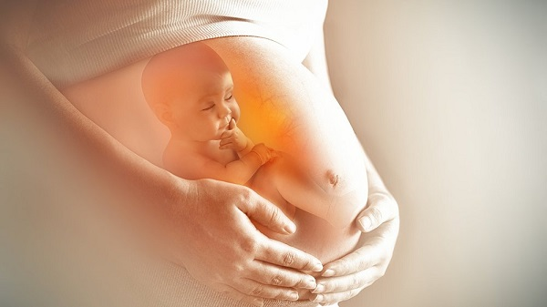
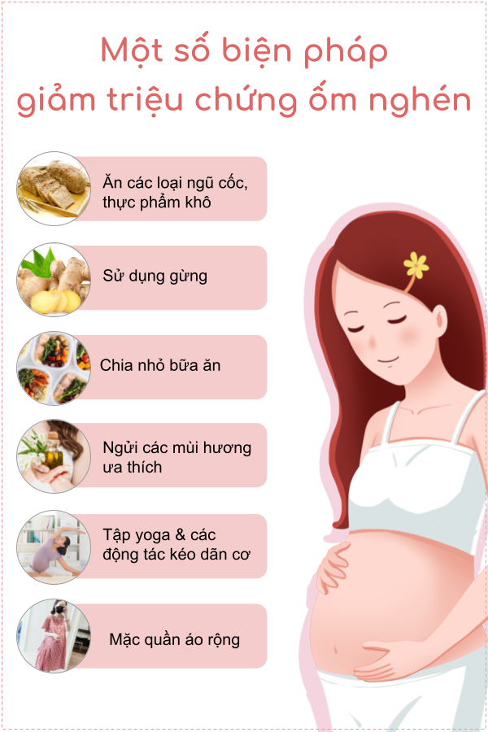
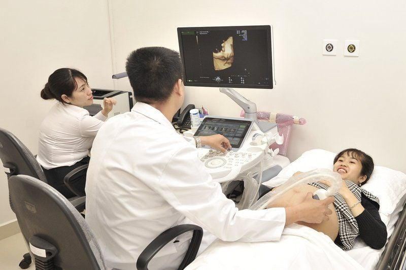
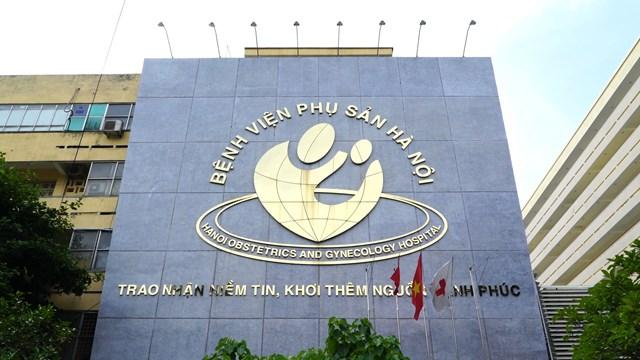

# Tuần 9

## **1\. Ốm nghén và những điều mẹ bầu cần biết**

* 09:24:37 04-11-2022  
* 2 phút đọc  
* 2k

### **1\. Ốm nghén là gì?**

Trước hết, ốm nghén là gì nhỉ?

*Ốm nghén là tập hợp những hiện tượng khó chịu xảy ra với mẹ bầu như đầy hơi, buồn nôn, nhạy cảm với mùi vị,...*

Theo thống kê, có đến 80% mẹ bầu gặp phải một trong những biểu hiện này trong những tháng đầu của thai kỳ.

*Tình trạng ốm nghén sẽ xuất hiện vào khoảng tuần thứ 6, đạt đỉnh điểm vào tuần thứ 7 đến tuần thứ 11, sau đó thuyên giảm dần vào khoảng tuần thứ 13, 14.*

### **2\. Triệu chứng ốm nghén**

Thông thường, mỗi mẹ bầu sẽ có một những biểu hiện nghén khác nhau, nhưng những biểu hiện sau đây là thường gặp nhất:

#### **2.1. Buồn nôn, nôn ói**

Trong thời gian ốm nghén, mẹ bầu rất dễ cảm thấy buồn nôn, thậm chí là gặp tình trạng nôn ói ngay sau khi ăn. 

Bên cạnh đó, nhiều thay đổi khác liên quan đến hệ tiêu hóa có thể xuất hiện, như: ợ nóng, chán ăn, cảm giác khó chịu trong bụng… Những triệu chứng này có thể xuất hiện bất kỳ lúc nào, kể cả ngày hay đêm. 

*Nôn ói là biểu hiện ốm nghén thường gặp nhất ở các mẹ bầu.* 

#### **2.2. Buồn ngủ, mệt mỏi**

Do ảnh hưởng của sự thay đổi hoóc môn trong thời kỳ đầu thai kỳ, cảm giác buồn ngủ, mệt mỏi sẽ đặc biệt trở nên rõ rệt. 

Mẹ bầu thường cảm thấy lúc nào cũng buồn ngủ bất kể sáng tối và cơ thể rất uể oải, mệt mỏi, thiếu năng lượng.

#### **2.3. Mẫn cảm với một số mùi**

Trong thời gian ốm nghén, mẹ bầu có thể cảm thấy khó chịu với những mùi mà trước đây mình không hề thấy vấn đề gì, chẳng hạn như mùi thức ăn, nước hoa hoặc bất kỳ mùi nào khác. Cảm giác buồn nôn có thể xuất hiện đột ngột khi ngửi thấy những mùi này.

Sự mẫn cảm với mùi vị xuất hiện với mẹ bầu do sự rối loạn thần kinh thực vật hoặc do khứu giác trở nên nhạy cảm hơn trong thời gian đầu thai kỳ.

#### **2.4. Thay đổi khẩu vị**

Khẩu vị của mẹ bầu có thể thay đổi một cách bất ngờ trong thời gian ốm nghén. 

Những món ăn mà trước khi mang thai từng là khoái khẩu bỗng nhiên lại gây ra sự khó chịu. Ngược lại, những món trước đây mẹ không hề yêu thích thì nay lại có thể ăn rất nhiều. 

Nhiều mẹ bầu còn có khuynh hướng chỉ ăn duy nhất một loại thức ăn nào đó như: hoa quả chua, đồ ăn dầu mỡ, thức ăn được nêm nêm nếm cay hoặc mặn…

### **3\. Ốm nghén có gây nguy hiểm cho thai nhi không?**

Trước hết, ốm nghén là những "phản ứng" bình thường của cơ thể trước sự hình thành của em bé trong bụng mẹ. **Vì vậy, về bản chất, ốm nghén sinh lý hoàn toàn không gây ra nguy hiểm cho thai nhi**.

Một số nghiên cứu còn chỉ ra rằng những triệu chứng như nôn ói, nhạy cảm với mùi vị là cơ chế bảo vệ em bé khỏi các mầm bệnh hay hóa chất từ thực phẩm. Mẹ bầu đừng quá lo lắng nhé.

*Nhiều mẹ bầu lo lắng không biết liệu ốm nghén có gây ảnh hưởng gì đến em bé trong bụng hay không.*

### **4\. Cách giảm triệu chứng ốm nghén khi mang thai**

Mặc dù ốm nghén sinh lý không gây nguy hiểm cho thai nhi, nhưng lại gây rất nhiều phiền toái và mệt mỏi cho cơ thể người mẹ. 

Vì vậy, nếu cảm thấy quá khó chịu với các triệu chứng, mẹ bầu có thể tham khảo một số cách biện pháp giảm nghén sau đây:

#### **4.1. Ăn các loại ngũ cốc, thực phẩm khô**

Ngũ cốc nguyên hạt và các loại thực phẩm khô như bánh mì, bánh bao, ruốc, bánh quy… rất tốt cho mẹ bầu vì chúng chứa nhiều carbohydrate và ít chất béo. 

Những thực phẩm này có khả năng hút bớt axit trong dạ dày, giúp hệ tiêu hóa của mẹ hoạt động trơn tru hơn. Nhờ đó, mẹ bầu sẽ cảm thấy dễ chịu hơn, giảm bớt các cơn buồn nôn, ợ nóng và trào ngược dạ dày.

*\>\> Xem thêm: [**Top 5 Ngũ cốc bầu được các mẹ tin dùng**](https://9thang10ngay.net/post/top-5-ngu-coc-cho-ba-bau-tot-nhat-hien-nay)*

#### **4.2. Sử dụng gừng**

Theo nhiều nghiên cứu, gừng an toàn với phụ nữ mang thai và có hiệu quả trong việc ngăn ngừa chứng buồn nôn. 

Mẹ bầu có thể thêm gừng vào khi chế biến các món ăn hoặc nhâm nhi một tách trà gừng mỗi khi buồn nôn cũng mang lại hiệu quả rất tốt.

#### **4.3. Chia nhỏ bữa ăn và bổ sung nước từng chút một**

Chia thành nhiều bữa ăn nhỏ (4-6 bữa/ngày) và uống nước từng ngụm nhỏ sẽ giúp cơ thể dễ hấp thụ hơn.

Đồng thời, tăng "tần suất" ăn uống giúp bù lại lượng dinh dưỡng bị mất đi do tình trạng nôn ói.

Mẹ bầu hãy luôn mang theo trong người một chút đồ ăn khô và nước uống để dùng bất kỳ khi nào có thể nhé.

*\>\> Xem thêm: [**Những món ăn vặt phù hợp cho bà bầu**](https://9thang10ngay.net/post/nhung-mon-an-vat-phu-hop-cho-ba-bau)*

#### **4.4. Ngửi những mùi hương ưa thích**

Sử dụng những mùi hương yêu thích để lấn át những mùi gây khó chịu là một bí quyết nhỏ để mẹ bầu cảm thấy dễ chịu hơn. 

Mẹ bầu có thể sử dụng đèn đốt tinh dầu trong phòng hay nhỏ vào khăn tay, cổ tay để nhẹ nhàng thưởng thức.

Tuy nhiên, ***cần tuyệt đối tránh xa những loại mùi hương*** gây ra các cơn co tử cung, không tốt cho phụ nữ mang thai như: ***quế, nhài (lài), xô thơm, thì là, sả chanh***…

Mẹ hãy tham khảo ý kiến của bác sĩ và đọc kỹ hướng dẫn sử dụng của tinh dầu trước khi sử dụng nhé.

#### **4.5. Tập yoga, thực hiện các động tác kéo dãn cơ bắp**

Thực hiện các động tác yoga, kéo giãn cơ kết hợp với hít thở nhịp nhàng sẽ giúp máu huyết toàn thân lưu thông tốt hơn, cảm giác khó chịu do bị ốm nghén cũng sẽ giảm bớt. 

Mẹ bầu có thể tập hằng ngày vào buổi sáng mới thức dậy hoặc buổi tối trước khi đi ngủ để có giấc ngủ ngon hơn.

#### **4.6. Mặc quần rộng rãi, thoải mái**

Quần áo hay đồ lót bó chặt có thể khiến cho mẹ cảm thấy khó chịu và lưu thông máu kém hơn. Vì vậy, mẹ hãy đổi sang các loại quần áo, váy bầu rộng rãi hay áo ngực không dây nhé.

*\>\> Xem thêm: [**Quần lót bầu nào tốt? Top 5 lựa chọn hàng đầu cho mẹ bầu thoải mái**](https://9thang10ngay.net/post/top-5-quan-lot-cho-ba-bau-tot-nhat-hien-nay)* 

*Mặc quần áo rộng rãi cũng là một biện pháp giúp mẹ bầu giảm ốm nghén.* 

### **5\. Khi nào mẹ bầu cần đến gặp bác sĩ?**

Nếu đã thực hiện nhiều biện pháp nhưng tình trạng nôn ói vẫn xảy ra với tần suất cao, rất có thể mẹ bầu đã gặp hội chứng **nôn nghén** hay **ốm nghén bệnh lý**. 

Theo thống kê, tình trạng này xuất hiện ở khoảng 1% \- 1.5% số phụ nữ mang thai, khiến cơ thể người mẹ bị mất nước, thiếu dinh dưỡng, ảnh hưởng sức khỏe của mẹ cũng như sự phát triển của thai nhi. 

Vì vậy, nếu xuất hiện những dấu hiệu của hội chứng nôn nghén, mẹ bầu cần đến gặp bác sĩ ngay. Dấu hiệu của hội chứng nôn nghén bao gồm: 

\- Nôn ói nhiều lần trong ngày, hầu như không ăn và uống được gì. 

\- Nước tiểu sẫm màu, lượng nước tiểu ít đi thấy rõ. 

\- Cơ thể mỏi mệt, thường chóng mặt hoặc dễ choáng váng khi đứng lên.

\- Da và môi bị khô. 

\- Bị sút 1-2kg trong một tuần. 

Sau khi thăm khám và làm các xét nghiệm cần thiết, bác sĩ sẽ đưa ra những chỉ định y khoa giúp mẹ bầu giảm tình trạng nôn, bù nước và điện giải. 

Mẹ bầu cần tuyệt đối tuân thủ theo hướng dẫn của bác sĩ và không tự ý thực hiện truyền nước hay sử dụng các loại thuốc chống nôn nghén tại nhà.

### **6\. Tổng kết**

Ốm nghén là hiện tượng thường gặp ở hầu hết các phụ nữ mang thai. Mặc dù không gây nguy hiểm cho thai nhi nhưng các triệu chứng như nôn ói, chán ăn lại khiến cơ thể người mẹ gặp nhiều mệt mỏi. 

Mẹ bầu hãy kiên trì áp dụng những lời khuyên từ 9thang10ngay để vững vàng vượt qua giai đoạn này, đồng thời chú ý quan sát những biểu hiện nặng để kịp thời đến các cơ sở điều trị khi cần thiết nhé.

---

## **2\. Cách chọn nơi khám thai và sinh con an toàn cho mẹ và bé**

* 04:10:52 11-04-2025  
* 2 phút đọc  
* 2k

Chọn bệnh viện phù hợp giúp mẹ bầu an tâm và có thai kỳ thoải mái hơn. Vậy mẹ cần cân nhắc những yếu tố nào? Bài viết này sẽ hướng dẫn chi tiết, giúp mẹ dễ dàng tìm được bệnh viện tốt nhất để khám thai và sinh con. 

### **1\. Sức khoẻ của mẹ bầu**

Nếu mẹ bầu có thai kỳ khỏe mạnh, không có bất kỳ vấn đề sức khỏe nào, có thể đến các phòng khám thai sản tư nhân uy tín để khám. 

Tuy nhiên, nếu mẹ bầu có tiền sử thai kỳ, bệnh mãn tính hoặc có dấu hiệu bất thường như ra máu âm đạo, đau bụng dữ dội,... cần đến khám tại các bệnh viện phụ sản chuyên khoa để được theo dõi và chăm sóc tốt nhất. 

*Nếu sức khoẻ thai phụ yếu hoặc lớn tuổi (ngoài 30 tuổi) thì nên chọn những bệnh viện lớn.*

### **2\. Vị trí và nơi sinh sống** 

Mẹ nên chọn bệnh viện gần nhà (di chuyển không quá 30-45 phút) để thuận tiện cho các lần khám định kỳ (thường mỗi tháng một lần, hoặc hàng tuần ở giai đoạn cuối). 

Nếu bệnh viện quá xa hoặc khó tiếp cận, mẹ có thể gặp khó khăn, đặc biệt trong trường hợp khẩn cấp như chuyển dạ đột xuất.

Các bệnh viện lớn như Bệnh viện Phụ sản Trung ương (Hà Nội) hay Bệnh viện Từ Dũ (TP. HCM) thường nằm ở trung tâm, phù hợp với mẹ sống nội thành nhưng có thể xa nếu mẹ ở ngoại ô hoặc tỉnh lẻ.

Nếu không tiện đến bệnh viện lớn, mẹ có thể chọn bệnh viện tuyến huyện hoặc phòng khám địa phương, nhưng cần kiểm tra xem họ có đủ trang thiết bị và bác sĩ chuyên môn không.

**Mẹo nhỏ**: Dùng Google Maps để đo khoảng cách và thời gian di chuyển. Nếu có thể, hãy thử đến bệnh viện một lần để xem đường đi có thuận tiện không.

### **3\. Chất lượng dịch vụ và đội ngũ y tế** 

Một đội ngũ y tế giàu kinh nghiệm là "xương sống" của bệnh viện tốt. Các bác sĩ sản khoa, nữ hộ sinh cần có chuyên môn cao, đặc biệt nếu mẹ mang thai nguy cơ cao (ví dụ: tiểu đường thai kỳ, tiền sản giật).

Các dịch vụ cần thiết:

\- Xét nghiệm máu, siêu âm (2D, 4D), đo tim thai.

\- Hỗ trợ thai kỳ đặc biệt (như sinh non, đa thai).

\- Các lớp học tiền sản, tư vấn dinh dưỡng và chăm sóc sau sinh.

*Bệnh viện Phụ Sản Hà Nội \- Bệnh viện Phụ sản tuyến đầu khu vực miền Bắc.* 

***So sánh bệnh viện công và tư ở Việt Nam:***

\- **Bệnh viện công** (ví dụ: Từ Dũ, Phụ sản Hà Nội):

\+ Ưu điểm: Bác sĩ giỏi, nhiều kinh nghiệm, chi phí thấp nếu có bảo hiểm y tế.

\+ Nhược điểm: Đông đúc, phải chờ lâu, ít tiện nghi.

\- **Bệnh viện tư** (ví dụ: Vinmec, Hạnh Phúc):

\+ Ưu điểm: Dịch vụ chu đáo, cơ sở vật chất hiện đại, ít phải chờ đợi.

\+ Nhược điểm: Chi phí cao, không phải lúc nào cũng nhận bảo hiểm.

Mẹ nên tìm hiểu kỹ thông tin về cơ sở y tế trước khi quyết định, ưu tiên các cơ sở y tế có đội ngũ bác sĩ chuyên môn cao, trang thiết bị y tế hiện đại và nhận được đánh giá tốt từ các mẹ bầu.

### **4\. Chi phí và bảo hiểm** 

#### **4.1. Chi phí** 

Chi phí khám thai và sinh nở có thể khác nhau tùy vào loại hình dịch vụ và cơ sở y tế. Dưới đây là một số khoản chi phí cơ bản mẹ bầu cần chuẩn bị:

\- Khám thai định kỳ (khoảng 200.000-500.000 VNĐ/lần ở bệnh viện công, cao hơn ở bệnh viện tư).

\- Xét nghiệm, siêu âm (từ 100.000-1.000.000 VNĐ tùy loại).

\- Chi phí sinh nở (từ 5-20 triệu VNĐ, tùy sinh thường hay sinh mổ, công hay tư).

#### **4.2. Bảo hiểm** 

\- **Sinh ở bệnh viện công**: Nếu mẹ bầu sinh tại bệnh viện công đúng tuyến, bảo hiểm sẽ chi trả khoảng 80% chi phí, giúp giảm đáng kể gánh nặng tài chính.

\- **Sinh ở bệnh viện tư**: Ít nhận bảo hiểm công, nhưng một số nơi như Hồng Ngọc, Quốc tế Sản Nhi có gói khám thai trọn gói (khoảng 10-20 triệu VNĐ cho cả thai kỳ), giúp mẹ dễ dàng tính toán chi phí.

Mẹ bầu cần hỏi kỹ bệnh viện về chi phí từng dịch vụ và xem bảo hiểm của mẹ có được áp dụng không. 

Nếu chọn gói trọn gói, hãy đọc kỹ các điều khoản để tránh phát sinh thêm chi phí. 

*Tìm hiểu kỹ về bảo hiểm của bệnh viện giúp giảm gánh nặng tài chính, đảm bảo quá trình sinh nở diễn ra suôn sẻ và an tâm hơn.*

### **5\. Đánh giá từ các mẹ bầu** 

Ý kiến từ những người đã khám và sinh tại bệnh viện giúp mẹ bầu hiểu rõ hơn về chất lượng dịch vụ, thái độ nhân viên và sự thoải mái. 

Mẹ bầu có thể hỏi người thân hoặc đọc đánh giá trên các diễn đàn như Webtretho, nhóm Facebook để có cái nhìn thực tế và đưa ra quyết định phù hợp.

### **6\. Các yếu tố khác cần xem xét** 

Khi chọn bệnh viện, mẹ bầu cần xem xét các dịch vụ đặc biệt như phòng sinh gia đình, nơi người thân có thể ở cùng để giúp mẹ cảm thấy an tâm hơn. Ví dụ, bệnh viện Từ Dũ và Vinmec cung cấp dịch vụ này nhưng cần đăng ký trước. 

Ngoài ra, hỗ trợ sau sinh như tư vấn cho con bú, chăm sóc trẻ sơ sinh, hoặc dịch vụ ở cữ tại bệnh viện cũng rất quan trọng. 

Ở Việt Nam, các bệnh viện như AIH, FV (TP.HCM) được biết tới là nơi được các người nổi tiếng lựa chọn nhờ chất lượng dịch vụ chăm sóc theo chuẩn quốc tế.

Trong khi Hạnh Phúc được đánh giá cao về dịch vụ chăm sóc sau sinh chuyên nghiệp. 

Nếu mẹ muốn sinh theo phương pháp đặc biệt như sinh không đau hoặc sinh dưới nước, hãy hỏi trước xem bệnh viện có hỗ trợ không.

Dưới đây là một số bệnh viện uy tín để khám thai, mẹ bầu có thể tham khảo: 

**Tại Hà Nội:**

1\. Bệnh viện Phụ sản Trung ương

\- 43 Tràng Thi, Hoàn Kiếm, Hà Nội.

2\. Bệnh viện Phụ sản Hà Nội

\- Cơ sở 1: 929 La Thành, Ba Đình, Hà Nội.

\- Cơ sở 2: 38 P. Cảm Hội, Đống Mác, Hai Bà Trưng, Hà Nội.

\- Cơ sở 3: 10 Đ. Quang Trung, P. Quang Trung, Hà Đông, Hà Nội.

3\. Bệnh viện Đa khoa Hồng Ngọc

\- 8 Đ. Châu Văn Liêm, Mễ Trì, Nam Từ Liêm, Hà Nội.

\- 55 P. Yên Ninh, Quán Thánh, Ba Đình, Hà Nội.

4\. Bệnh viện Đa khoa Tâm Anh

\- Địa chỉ: 108 Hoàng Như Tiếp, Bồ Đề, Long Biên, Hà Nội.

5\. Bệnh viện Đa khoa Quốc tế Vinmec

\- 458 Minh Khai, Hai Bà Trưng, Hà Nội.

6\. Bệnh viện Đa khoa Quốc tế Thu Cúc

\- 286 Thụy Khuê, Tây Hồ, Hà Nội.

**Tại TP. Hồ Chí Minh:**

1\. Bệnh viện Từ Dũ

\- 284 Cống Quỳnh, Phường Phạm Ngũ Lão, quận 1, TP HCM.

2\. Bệnh viện Quốc Tế Mỹ (AIH) 

\- 199 Nguyễn Hoàng, phường An Phú, quận Thủ Đức, TP.HCM.

3\. Bệnh viện Đa Khoa FV

\- 6 Nguyễn Lương Bằng, Nam Sài Gòn (Phú Mỹ Hưng), quận 7, TPHCM.

4\. Bệnh viện Hùng Vương

\- 128 Hồng Bàng, phường 12, quận 5, TP HCM.

5\. Bệnh viện Phụ Sản Quốc Tế Sài Gòn (SIH)

\- 63 Bùi Thị Xuân, Phường Phạm Ngũ Lão, quận 1, TP.HCM.

6\. Bệnh viện Phụ Sản Mêkông  
\- 243 \- 243A \- 243B Hoàng Văn Thụ, phường 1, quận Tân Bình, TP HCM.

7\. Khoa Sản \- Bệnh viện Đại học Y Dược TP HCM  
\- 215 Hồng Bàng, phường 11, quận 5, TP HCM (Cơ sở 1\)

**Lời khuyên:**

\- Nên đi khám thai sớm nhất có thể, ngay sau khi biết mình mang thai để được theo dõi và chăm sóc thai kỳ tốt nhất.

\- Nên chọn một bác sĩ sản khoa mà bạn tin tưởng và cảm thấy thoải mái khi trao đổi về sức khỏe của bản thân và thai nhi.

\- Tuân thủ lịch khám thai định kỳ theo hướng dẫn của bác sĩ.

\- Chăm sóc sức khỏe bản thân tốt bằng cách ăn uống đầy đủ dinh dưỡng, nghỉ ngơi hợp lý và tập thể dục thường xuyên.

Chúc các mẹ bầu có một thai kỳ khỏe mạnh và an toàn\!
